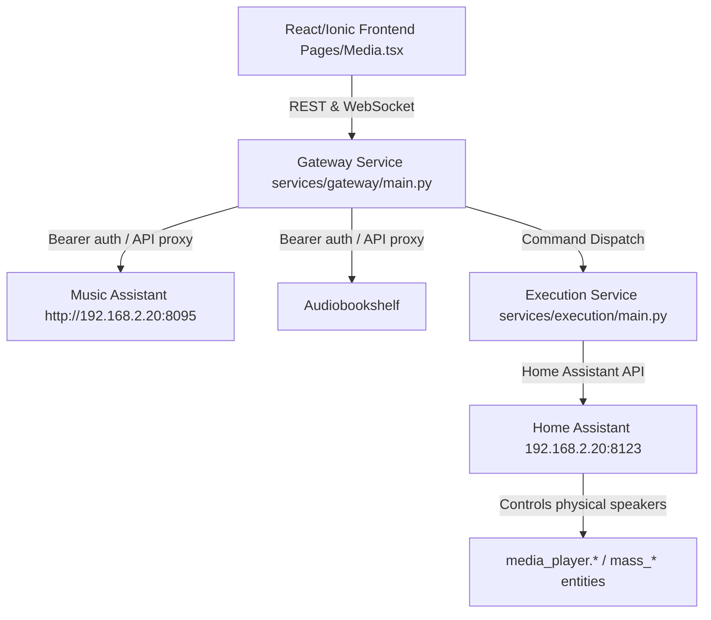

# Jarvis OS 2.0: Media Player System & UI Specifications

This document outlines the architecture, visual guidelines, and API interfaces for the Jarvis OS 2.0 Media Player. The system supports casting playback to remote devices via Home Assistant (HA) and Music Assistant (MA), as well as playing streamable audio locally inside the browser or native mobile client using a secure gateway proxy.

---

## 1. Architectural Overview

The Jarvis Media Player is powered by a dual-backend architecture integrated into a unified frontend interface:



### 1.1 Remote Media Playback (Casting)

Remote playback targets physical speakers or TV media players managed by Home Assistant.

* **Announcements & TTS:** Handled via Kokoro TTS, broadcasted through local room speakers.
* **Music Casting:** Controlled via Music Assistant v2. The execution service dispatches play commands directly using the HA integration helper (`music_assistant.play_media`), targeting specific media player entities (e.g. `media_player.mass_living_room`).
* **Audiobook Casting:** Dispatched directly to Audiobookshelf servers or casted to target players.

### 1.2 Local Media Playback (Browser Mode)

Local playback uses the browser's native `<audio>` element (or Capacitor's Native Audio player on Android).

* Streamed data is brokered via the Gateway proxy, injecting credentials and handling HTTP range requests.
* **Audiobookshelf Stream:** Fetched directly from ABS endpoints with token auth.
* **Music Assistant Stream:** Proxied via the `/api/media/stream/music-assistant` gateway endpoint.

#### Music Assistant Streaming Architecture Deep Dive

The current `/api/media/stream/music-assistant` implementation proxies MA's `/preview` endpoint, which only provides **~30 second previews** — not full tracks. To stream full audio, the system must use Music Assistant's native streaming pipeline:

**MA Stream Server (`controllers/streams/controller.py`):**

* MA hosts an unprotected HTTP-only webserver (default port 8097) for streaming audio packets to players.
* Routes:
  * `/flow/{session_id}/{queue_id}/{queue_item_id}/{player_id}.{fmt}` — continuous flow stream (crossfade, gapless)
  * `/single/{session_id}/{queue_id}/{queue_item_id}/{player_id}.{fmt}` — single track stream
  * `/command/{queue_id}/{command}.mp3` — command responses (next/silence)
  * `/announcement/{player_id}.{fmt}` — announcement audio
* Stream URLs are generated by `StreamsController.resolve_stream_url()` which builds the URL from `PlayerMedia` data.
* The stream server does **NOT** have a public `/preview` endpoint — this is an MA REST API endpoint for short previews.

**OpenSubsonic Provider (`providers/opensubsonic/sonic_provider.py`):**

* The `opensubsonic--dK3sUSj4` provider connects to Navidrome via `libopensonic` (OpenSubsonic API).
* Full audio streaming is done via `get_audio_stream()` which calls `self.conn.stream(item_id, time_offset=seek_position, ...)` against Navidrome's Subsonic API.
* The actual audio stream URL pattern is: `{navidrome_baseURL}/rest/stream.song?id={songId}&u={user}&p={password}`.
* Provider credentials (baseURL, username, password) are stored in MA's config and can be queried via MA's JSON-RPC API.
* Default `_raw_file = True` means original source files without transcoding.

**Correct Full-Audio Streaming Flow:**

1. Resolve track metadata via `music/item_by_uri` → get `provider_instance` and `provider_item_id`
2. Query MA's config API for OpenSubsonic provider credentials (baseURL, username, password)
3. Construct direct Subsonic stream URL to Navidrome: `{baseURL}/rest/stream.song?id={item_id}&u={user}&p={password}`
4. Proxy the stream to the browser client, handling HTTP Range headers for seeking

---

## 2. Visual Design & UI Specifications

In alignment with the **"Neon Glass"** design system, the Media Player uses semi-transparent cards, sharp typography, and cyan-glowing accents.

### 2.1 The Dashboard Layout (`/media`)

```text
+-------------------------------------------------------------+
| [Back]                    MEDIA HUB                         |
+-------------------------------------------------------------+
|  +-------------------------------------------------------+  |
|  |               ACTIVE PLAYBACK TARGET                  |  |
|  |  [Icon] Currently Playing: Living Room Speaker   [Cast] |  |
|  +-------------------------------------------------------+  |
|                                                             |
|   RECENTLY PLAYED (MA)            PLAYLISTS (MA)            |
|   +-------------------+           +-------------------+     |
|   | Thank You         |           | Morning Vibes     |     |
|   | Brandon Lake      |           | 14 Tracks         |     |
|   +-------------------+           +-------------------+     |
|   | Graves Into G...  |           | Workout Mix       |     |
|   | Elevation Wors... |           | 32 Tracks         |     |
|   +-------------------+           +-------------------+     |
|                                                             |
|   AUDIOBOOKS (ABS)                                          |
|   +-------------------------------------------------------+ |
|   | [Cover Art]  The Hobbit                               | |
|   |              J.R.R. Tolkien (84% completed)           | |
|   +-------------------------------------------------------+ |
|                                                             |
|=============================================================|
|                    PERSISTENT PLAYER BAR                    |
|   [Cover] Title - Artist          [Prev] [Play/Pause] [Next]|
|   Progress bar [================------------------------]   |
+-------------------------------------------------------------+
```

### 2.2 Aesthetic Guidelines

* **Theme Color:** Cyan (`#06b6d4`) glows are used strictly for media-related elements.
* **Backdrop Blur:** Floating action drawers and player sheets use `backdrop-blur-xl` with a semi-transparent dark background (`rgba(15, 23, 42, 0.75)` / Slate 900).
* **Player Hero Card:**
  * Displays high-resolution cover art fetched through the `/api/media/imageproxy` endpoint.
  * Adds a subtle radial shadow using the dominant color of the cover art to simulate an ambient light halo.
* **Sliders & Controls:**
  * Draggable progress bars and volume sliders glow cyan when active.
  * Symmetrical, frosted-glass circular control keys.

---

## 3. Backend Interfaces & API Protocols

### 3.1 Streaming Gateway Endpoints

#### Local Music Assistant Stream

* **Endpoint:** `GET /api/media/stream/music-assistant?uri=library://track/1759`
* **Query Params:** `uri` (e.g. `library://track/1759`)
* **Headers:** `Authorization: Bearer <jarvis_api_token>`
* **Description:** Resolves the track's media provider details via MA's JSON-RPC endpoint (`music/item_by_uri`), retrieves the active provider instance and item ID, queries OpenSubsonic provider credentials from MA config, and proxies the full-audio stream from Navidrome's Subsonic API endpoint (`/rest/stream.song`).
* **Supported response headers:** `Content-Range`, `Content-Length`, `Content-Type` (properly proxied to support seeking in browser/mobile audio players).
* **Implementation:** `services/gateway/main.py` → `stream_music_assistant()` (lines 5022-5199)

#### Local Audiobookshelf Stream

* **Endpoint:** `GET /api/media/stream/audiobookshelf/{id}`
* **Query Params:** `token` (Jarvis API key)
* **Description:** Streams direct audio files from ABS to the local client.

---

### 3.2 ABS Library Search

The gateway provides a unified search endpoint that searches the local ABS library first, then falls back to external metadata (iTunes, Audnexus) if no library matches are found.

#### Gateway Search Endpoint

* **Endpoint:** `GET /api/media/audiobookshelf/search?q=<query>&limit=<n>`
* **Headers:** `Authorization: Bearer <jarvis_api_token>` (per-user credentials)
* **Description:** Searches the ABS library using the `/api/libraries/{book_library_id}/items?query=<q>&limit=<n>` endpoint. If no library matches are found, falls back to external metadata search (iTunes books, podcasts, Audnexus authors).

**Request:**

```text
GET /api/media/audiobookshelf/search?q=mark&limit=5
```

**Response (Library Search Success):**

```json
{
  "status": "SUCCESS",
  "books": [
    {
      "id": "510e38dd-3196-4755-8a9b-7c81208c373b",
      "title": "God's Smuggler (Unabridged)",
      "author": "Brother Andrew",
      "narrator": "Simon Vance",
      "series": "",
      "publishedYear": "2009-07-29",
      "genres": ["Religious", "Missions"],
      "duration": 31745,
      "duration_formatted": "8h 49m",
      "progress": {},
      "play_url": "https://abs.sumemail.com/api/items/510e38dd-3196-4755-8a9b-7c81208c373b/stream?format=mp4&token=<jwt>",
      "cover": ""
    }
  ],
  "podcasts": [],
  "authors": [],
  "total": 1
}
```

**Response (External Metadata Fallback):**

```json
{
  "status": "SUCCESS",
  "books": [
    {
      "id": "B07HHH7L77",
      "title": "The Hunger Games",
      "author": "Suzanne Collins",
      "narrator": "",
      "publisher": "Scholastic Audio",
      "description": "...",
      "cover": "https://covers.example.com/...",
      "genres": [],
      "publishedYear": "2010",
      "asin": "B07HHH7L77",
      "type": "book",
      "source": "external"
    }
  ],
  "podcasts": [
    {
      "id": "123456789",
      "title": "The Daily",
      "author": "The New York Times",
      "description": "...",
      "cover": "https://covers.example.com/...",
      "trackCount": 100,
      "genres": ["News"],
      "feedUrl": "https://feeds.example.com/daily",
      "explicit": false,
      "type": "podcast",
      "source": "itunes"
    }
  ],
  "authors": [
    {
      "id": "author_123",
      "name": "Brandon Sanderson",
      "description": "...",
      "image": "https://covers.example.com/...",
      "asin": "",
      "type": "author",
      "source": "audnexus"
    }
  ],
  "total": 3
}
```

**Response (No Results/ABS Unavailable):**

```json
{
  "status": "SUCCESS",
  "books": [],
  "podcasts": [],
  "authors": [],
  "total": 0
}
```

#### Search Flow

1. **Library Search:** Uses the ABS API key to fetch all libraries, identifies the book library by `media_type='book'`, then searches within that library using `/api/libraries/{library_id}/items?query=<q>&limit=<n>`.
2. **External Fallback:** If library search returns no results, falls back to `abs_client.search_all()` which queries:
   - iTunes Search API (`https://itunes.apple.com/search`) for books and podcasts
   - Audnexus API (`https://audnexus.com/api/v3`) for authors
3. **Response Format:** Library results include `play_url` (direct ABS stream URL with JWT token) and `progress` (resume progress). External results include `source` field (`external`, `itunes`, `audnexus`) and `type` field (`book`, `podcast`, `author`).

#### ABS Stream URL Format

- **Library Stream:** `https://<abs_host>/api/items/{item_id}/stream?format=mp4&token=<jwt_api_key>`
- The JWT API key is stored in `.env` as `AUDIOBOOKSHELF_API_KEY` and is resolved per-user from identity settings.
- Format `mp4` produces M4B-compatible audio streams suitable for browser `<audio>` playback.

---

### 3.3 Music Assistant Search

The gateway provides a Music Assistant search endpoint forwarding to Home Assistant's `music_assistant.search` action.

#### Music Assistant Search Endpoint

* **Endpoint:** `GET /api/media/music-assistant/search?query=<query>&limit=<n>&library_only=<true|false>`
* **Headers:** `X-Internal-Secret: <secret>` (or user context resolved internally)
* **Parameters:**
  * `query`: Search query (e.g. track name, artist, or album)
  * `limit`: Max results to return (defaults to `20` / `30`)
  * `library_only`: Filter constraint (boolean, defaults to `true`)
    * When `true`, restricts matches only to items cataloged in the local Music Assistant database.
    * When `false`, searches external streaming providers (e.g., Spotify, SoundCloud) in addition to local library database items.

**Request:**

```text
GET /api/media/music-assistant/search?query=Miles+Davis&library_only=true
```

**Response (Success):**

```json
{
  "status": "SUCCESS",
  "query": "Miles Davis",
  "results": [
    {
      "name": "So What",
      "uri": "library://track/123",
      "type": "track",
      "artist": "Miles Davis",
      "duration": 562
    }
  ]
}
```

#### Error Handling & Downstream Failure Capture

If the connection to the downstream Home Assistant or Music Assistant service fails or times out, the search endpoint returns a `FAILURE` status instead of silently falling back to a `SUCCESS` envelope with 0 results.

**Response (Failure):**

```json
{
  "status": "FAILURE",
  "message": "Home Assistant Music Assistant service call failed (Connection Timeout)",
  "results": []
}
```

---

### 3.4 Execution Service Commands

All remote casting requests are sent through `POST /execute/media/play`:

```json
{
  "user_context": {
    "user": "default",
    "is_admin": true
  },
  "entity_id": "media_player.mass_kitchen_speaker",
  "query": "library://track/1759",
  "media_type": "music"
}
```

* **Direct URI Playback:** If `query` contains a scheme identifier (`://`), the handler immediately bypasses text search and invokes the Home Assistant `play_media` service with `media_id` set to the URI.
* **Text Fallback:** If `query` is a simple text string (e.g. "play some jazz"), the execution service calls `music_assistant.search` to resolve the best match before playing.

---

### 3.5 State Syncing & Polling

The frontend tracks the active playback state using two mechanisms:

1. **Long Polling (`GET /api/media/status`):**
   * Dispatched every 3-5 seconds to check the state of the active speaker.
   * Returns details of active `media_title`, `media_artist`, `position`, `duration`, `volume_level`, and `state` (`playing` / `paused` / `idle`).
2. **Local Audio Sync (`POST /api/media/state/sync`):**
   * When in Local (browser) playback mode, the client reports its own `<audio>` player state to the backend.
   * Registers `entity_id: "local_player"` so that other dashboards in the house know the active user is currently listening to music locally.

---

## 4. Troubleshooting and Edge Cases

* **Audio/Video Mismatch (Resolved):** In previous iterations, requesting a local stream for a library track would fall back to a YouTube search if a direct stream URL was not returned in the track metadata. This resulted in video audio being played. The current system resolves this by fetching audio directly from Music Assistant's native `/preview` streaming route.
* **Token Suffixes:** Always attach the `token` parameter when requesting streaming audio through media tags in HTML, as the browser's source tags do not allow custom HTTP request headers.
* **Preview-Only Streaming (In Progress):** MA's `/preview` endpoint only provides ~30 second previews, not full tracks. The fix involves querying MA's config API for OpenSubsonic provider credentials (Navidrome baseURL, username, password) and constructing a direct Subsonic stream URL (`/rest/stream.song`) to access full audio tracks.
* **Provider Instance Format:** OpenSubsonic provider instances follow the pattern `{provider_name}--{provider_uuid}`, e.g., `opensubsonic--dK3sUSj4`.
* **Provider Item ID Format:** OpenSubsonic provider item IDs are prefixed with the media type: `track-{navidrome_id}`, `album-{navidrome_id}`, `artist-{navidrome_id}`.
* **MA Server Version:** 2.8.9 (Home Assistant addon at `192.168.2.20:8095`).
* **Navidrome Connection:** The OpenSubsonic provider uses `libopensonic` async library to connect to Navidrome. The `_raw_file` config is `True` (no transcoding).
* **Real Test URIs:**
  * `library://track/1759` - "Thank You" by Brandon Lake
  * `library://track/1011` - "Just Like Heaven" by The Cure
  * `library://track/735` - "Help!" by The Beatles
* **Audio Format:** `mpeg` (119 kbps, 44100 Hz, 16-bit, stereo) from OpenSubsonic provider.
* **MA JWT Token:** Stored in `.env` file. Admin token for user "summers" with long-lived expiry.

