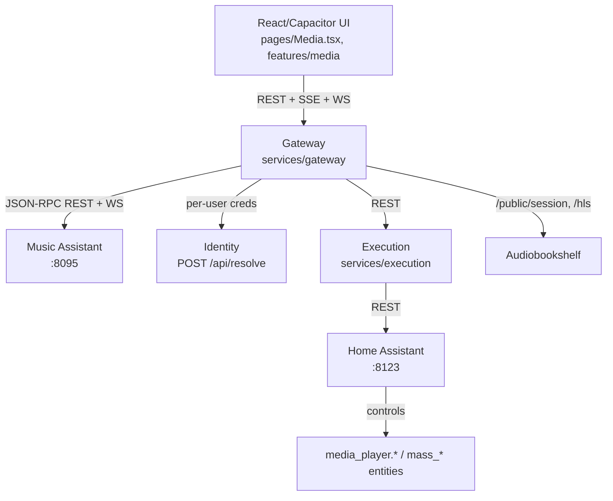

# Jarvis OS Media Player

Architecture, API contract and UI notes for the media feature. The upstream
provider contracts live in `docs/MEDIA_UPSTREAM_API_NOTES.md` (kept current with
live probes); task-by-task history lives in `docs/MEDIA_OVERHAUL.md`.

---

## 1. Architecture


```mermaid
graph TD
    UI[React/Capacitor UI<br/>pages/Media.tsx, features/media] -->|REST + SSE + WS| GW[Gateway<br/>services/gateway]
    GW -->|JSON-RPC REST + WS| MA[Music Assistant<br/>:8095]
    GW -->|per-user creds| ID[Identity<br/>POST /api/resolve]
    GW -->|REST| EX[Execution<br/>services/execution]
    EX -->|REST| HA[Home Assistant<br/>:8123]
    GW -->|/public/session, /hls| ABS[Audiobookshelf]
    HA -->|controls| PLAYERS[media_player.* / mass_* entities]
```

* **The gateway is the only authenticated surface.** Every media route resolves
  the caller strictly first; an unproven caller gets `401`, never an empty 200.
* **Credentials are per-user and resolved at request time** from Identity
  (`ha_url`/`ha_token`, `mass_url`/`mass_token`, `audiobookshelf_url`/
  `audiobookshelf_api_key`). Nothing media-related is baked into an image.
* **Music Assistant** is called directly over JSON-RPC (`_ma_rpc`, and the
  `MAWebSocketClient` for queue operations). The browser never talks to MA with
  credentials: its control socket is the gateway's `/api/ma-jsonrpc` proxy.
* **Audiobookshelf** listing/search goes through the execution service
  (`/execute/audiobookshelf`); item detail and imageproxy are direct gateway
  calls with the caller's key; playback is session-based HLS without a key.
* **Execution** owns everything that needs Home Assistant: `play`, `transport`,
  `status`, brand TV handlers and the local playback registry.

---

## 2. Authentication

| Mechanism | Where | Notes |
| --- | --- | --- |
| `Authorization: Bearer <api key>` | every REST route | Strict: invalid key → 401 |
| `?mt=<token>&user=<user>` | ABS session streams, execution file server `:8888`, `/api/media/events` | `POST /api/media/token` issues it |
| `?token=<api key>` | `/api/ma-jsonrpc`, `/api/sendspin` WebSockets | WebSocket clients cannot set headers |

`POST /api/media/token` returns `{token, expires_at}`. The token is
HMAC-SHA256 over `{user, scope:"media", exp}` signed with `MEDIA_TOKEN_SECRET`
(falling back to `INTERNAL_SECRET`); TTL is 1 hour for UI use, 12 hours for
device URLs embedded in HA/Cast/Roku playback (`services/shared/media_token.py`).
Caddy redacts `token` and `mt` query values from its access log.

`/api/media/events` (SSE) accepts either the bearer header (native) or
`?mt=&user=` (browser `EventSource`).

---

## 3. Unified REST endpoints

One call per screen. Wire shapes are Pydantic models in
`services/gateway/media_models.py`; the generated JSON Schema dump
(`services/ui/src/features/media/__generated__/schemas.json`) is kept in
lockstep by a pytest drift guard and validated against UI fixtures with ajv
(§9).

### `GET /api/media/home`

Listen Now in one request: five MA shelves + ABS “continue listening”, each
fetched with a 4 s timeout in parallel. Downstream failures degrade to partial
data with a named error, never a 500.

```json
{
  "recent": [], "continue": [], "playlists": [], "favorites": [], "radio": [],
  "errors": {"ma": null, "abs": null}
}
```

### `GET /api/media/search?q=&types=&limit=`

Unified search. `types` is a CSV subset of `tracks,artists,albums,playlists,
audiobooks,podcasts,authors`; ABS is queried only when no filter is given or
the filter touches `audiobooks`/`podcasts`/`authors`. `top` is the first exact
case-insensitive title match, else the first track.

```json
{
  "top": null, "tracks": [], "artists": [], "albums": [], "playlists": [],
  "audiobooks": [], "podcasts": [], "authors": [],
  "errors": {"ma": null, "abs": null}
}
```

### `GET /api/media/item?uri=`

Album/artist/playlist/book/podcast detail with children.

* MA URIs (`library://…`, `spotify://…`, …) → `music/item_by_uri` plus the
  matching child command (`playlist_tracks`, `album_tracks`, `artist_albums`,
  `podcast_episodes`). Child calls pass `item_id` **and**
  `provider_instance_id_or_domain` (live-verified contract).
* `abs://<item_id>` → `GET {abs}/api/items/<id>?expanded=1`; podcast episodes
  and book chapters become `children` with `abs://` URIs.

Unknown URIs are `404`; an unreachable upstream is `502`; missing `uri` is
`422`.

### `GET /api/media/library/{tab}?offset=&limit=&order_by=`

Paginated library. Tabs: `tracks, albums, artists, playlists, radio, podcasts`
→ MA `music/<tab>/library_items` (plus `favorite` where relevant); tab
`audiobooks` → ABS libraries (or the books of one library with `library_id`).
An unknown tab is `422`.

### `GET /api/media/favorites`

Parallel `favorite=true` query across MA tracks/albums/artists/playlists,
merged into one list. (The `favorite` parameter is live-verified on MA.)

### `POST /api/media/abs/progress`

Forwarded to the execution service, which calls
`PATCH /api/me/progress/{item_id}[/{episode_id}]`.

```json
{"item_id": "…", "episode_id": "…", "current_time": 123.4, "duration": 3600, "is_finished": false}
```

The UI reports progress every 15 s while an ABS item plays on any output, and
on pause/stop.

### Provider endpoints (kept)

The pre-§7.5 routes remain for the widget and existing screens:

* `GET /api/media/music-assistant/playlists|recent|browse|search`
* `GET /api/media/audiobookshelf/libraries|last-played|library/{id}|search|status`
* `GET /api/media/detail?uri=`, `POST /api/media/favorite`,
  `POST /api/media/ma-library-uri` (ABS item → playable MA URI)
* `GET /api/media/imageproxy?path=&token=` (per-user ABS/MA image fetch)

---

## 4. Playback and transport (execution)

### `POST /execute/media/play`

```json
{"user_context": {"user": "default"}, "entity_id": "media_player.mass_kitchen",
 "query": "library://track/1759", "media_type": "music"}
```

A `query` containing `://` is played directly; plain text goes through MA
search first. Local targets (`local`, `web_player`) update the in-process
playback registry instead of calling HA.

### `POST /execute/media/transport`

`MediaTransportRequest.command` is a `Literal`; unknown values are rejected
with `422` before reaching HA.

| Command | Extra field | Effect |
| --- | --- | --- |
| `play`, `resume` | — | `media_play` |
| `pause` | — | `media_pause` |
| `stop` | — | `media_stop` |
| `next`, `previous` | — | `media_next_track` / `media_previous_track` |
| `seek` | `position` (s) | `media_seek`; missing position → explicit FAILURE |
| `volume_set` | `volume_level` (0–1) | `volume_set` |
| `volume_up`, `volume_down` | — | `volume_set` step |
| `volume_mute`, `mute` | `muted` (bool) | `volume_mute` |
| `home`, `back`, `power_off` | — | `remote.send_command` (TV) |
| `shuffle_set` | `shuffle` (bool) | `media_player.shuffle_set` |
| `repeat_set` | `repeat` (`off`/`one`/`all`) | `media_player.repeat_set` |
| `join` | `group_members` (list) | `media_player.join` |
| `unjoin` | — | `media_player.unjoin` |

**Routing rule (BUG-28):** the standard `media_player.*` service is used
whenever the entity advertises the feature bit for the requested command
(`supported_features`). Brand handlers (Android TV, webOS, Samsung, Roku) are a
**fallback** for entities that do not advertise it; their key maps were
verified against the HA integrations, and an unmappable command fails fast.
`PLAY_MEDIA` is bit `512`.

### `POST /execute/media/status`

Returns `{active, available, all_players}`. Each player is enriched for the UI:
state/metadata/volume, plus `media_content_id`, `media_position_updated_at`,
`shuffle`, `repeat`, `group_members`, `app_name`, `icon_kind` (`tv`/`speaker`)
and `ma_player_id` for Music Assistant players. Optional `area` / `entity_id`
filters. Until the event hub cache is wired into execution, this performs the
HA states read itself; the hub snapshot remains the source of truth for SSE.

### `POST /execute/media/state/sync`

Local (browser/Capacitor) players report their own state
(`entity_id: "local_player"`) so the rest of the house sees what is playing.
`MediaStateSyncRequest` carries the same enriched fields as above.

### MA control socket (`WS /api/ma-jsonrpc`)

The only way the browser talks to MA. Two server-side gates apply to every
client→MA frame:

1. **Command allowlist** (`services/gateway/ma_allowlist.py`, 47 commands) —
   anything else is answered with
   `{"error_code": "forbidden", "message_id": "<same id>"}` and never forwarded.
2. **Per-user player scope** (`services/gateway/ma_scope.py`) — commands that
   reference `player_id`/`queue_id`/`target_player`/`source_queue_id`/
   `target_queue_id`/`child_player_ids` must map to an entity the user may
   control (same rules as `verify_entity_access`). The user's own web player
   (its `sendspin` client id is recorded from `client/hello`) is exempt.

---

## 5. Streaming

### Music Assistant (`POST`/`GET /api/media/stream/music-assistant`)

* `POST` starts playback on the target player via the MA WebSocket
  (`player_queues/play_media`, replace) and returns the resolved stream URL
  once the queue reports one.
* `GET` resolves the stream URL for a queue that is already playing
  (`player_queues/get`). No resolvable session → `409`; start playback with
  `POST` first.
* The gateway holds no long-lived MA connection: each request uses a
  short-lived client and disconnects.

### Audiobookshelf session HLS

`GET /api/media/stream/abs-session/{session_id}/{track_index}` (and the
`/{segment}` sibling). ABS 2.x removed `GET /api/items/:id/stream`, so playback
is session-based: the execution service starts a session
(`POST /api/items/{bookId}/play`, or `.../play/{episodeId}` for podcasts) and
hands the device this URL. A session id is the capability — no ABS key is used
on `/public/session/...` or `/hls/...`. The playlist only appears once ABS has
started transcoding; a cold session is polled and answers `504` if it never
appears. Book tracks are 1-based (`media.tracks[0].index`), podcast episodes 0.

### Execution file server (`:8888`)

Locally generated media (TTS announcements, timer audio, cached video) is
served from `http://<execution-host>:8888/media/<id>?user=&mt=`. The server
verifies the signed media token before answering. The TTS byte cache is a
byte-ledgered LRU (32 entries / 128 MiB, reads refresh recency) and a hourly
lifespan task deletes `.mp4`/`.mp4.part`/`.wav` older than 24 h from the temp
media directory (the YouTube cookie jar is never touched).

---

## 6. Events (`GET /api/media/events`, SSE)

One hub per user (`services/gateway/media_events.py`) fans out normalized
events from HA (`state_changed` for `media_player.*`) and MA
(`player_updated`, `queue_updated`, `queue_items_updated`,
`queue_time_updated`). The stream starts with:

```text
retry: 3000

event: snapshot
{"type":"snapshot","players":[…normalized players…]}

event: player
{"type":"player","output_id":"media_player.kitchen","state":"playing","item":{…},"position":0,"volume":35,"muted":false,"shuffle":false,"repeat":"off","available":true,"group_members":[]}

event: queue
{"type":"queue","output_id":"ma:abcd","items_changed":true}

event: heartbeat
{"type":"heartbeat"}
```

Heartbeats arrive every 15 s when idle; the hub subscribes on the first
listener and stops 60 s after the last one leaves. Hubs are keyed by user and
never cross. Clients should reconnect on error, re-take the snapshot, and fall
back to 10 s status polling when the stream is down.

---

## 7. UI notes

* **Player bar & scrubber.** The progress drag is keyed on
  `media_content_id` so 3 s status polls do not cancel it; pointer moves are
  coalesced with `requestAnimationFrame`. Touch targets are ≥ 44 px
  (`py-5`, thumb 20 px); hover reveals are desktop-only. Live streams
  (`duration <= 0`) show a LIVE bar instead of a scrubber. Seek failures
  surface a toast on the page and the widget.
* **Mobile parity.** The media screen and its widgets work at phone widths
  inside `BentoBoxDashboard` (~280 px columns); use `pointer-coarse:min-h-11`
  for touch rows, `useHaptics()` for tactile feedback and Capacitor native
  audio where it fits. Never make hover or drag the only path to an action.
* **Partial state.** Every screen renders `loading`/`empty`/`error`/`partial`
  states; a partial response names the unreachable provider
  (“Music Assistant is unreachable”) and keeps the working shelves.

---

## 8. Contract tests

* `services/gateway/tests/test_media_schema_contract.py` dumps every model in
  `media_models.py` to `services/ui/src/features/media/__generated__/schemas.json`
  (`UPDATE_MEDIA_SCHEMAS=1 pytest …` regenerates) and fails CI when the dump
  drifts from the models.
* `services/ui/src/features/media/schemaContract.test.ts` validates realistic
  fixtures against the dump with ajv (`strict: false`, draft 2020-12) and
  asserts every generated schema has a fixture.
* Endpoint tests: `services/gateway/tests/test_media_endpoints.py`
  (merges, partial upstreams, exact MA/ABS arguments, 404/422/502, progress
  proxy) and the anonymous-access matrix in
  `test_anonymous_access_is_refused.py`.

## 9. Troubleshooting

* **401 on every media route** — the caller was not proven; sign in again.
  There is no anonymous fallback by design.
* **“Music Assistant is unreachable”** — per-user `mass_url`/`mass_token`
  missing or MA down; check Identity settings, then MA on its own port. The
  same pattern names ABS failures.
* **Transport does nothing** — check `supported_features`: a feature the
  entity does not advertise falls through to the brand handler, and an
  unmappable command is rejected loudly.
* **Stream 409** — playback has not been started (or has ended); POST the
  stream route first. **504** on an ABS session means ABS never produced the
  HLS playlist.
* **Stale player list** — the SSE hub stops after 60 s without listeners;
  reconnect and wait for the snapshot.
