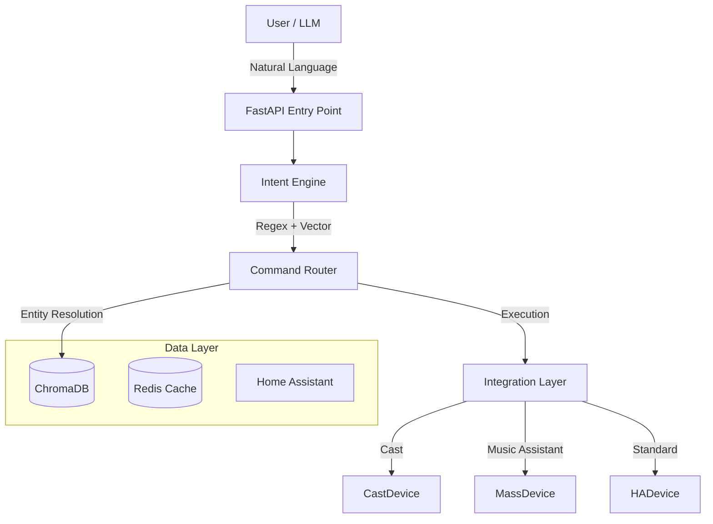

# SharedLLM System Architecture

## 1. System Overview

The **Unified RAG API** is an intelligent orchestration layer sitting between
the User (Voice/Chat) and the physical Smart Home (Home Assistant). It uses a
hybrid intent classification engine (Regex + Vector Search) to understand
natural language commands and route them to specific device integrations.

---

## 2. Core Components

### A. Lifecycle & Entry Point (`app/main.py`)

* **Framework**: FastAPI.
* **Startup**:
    1. `load_resources()`: Connects to Redis, ChromaDB, and loads the Embedding Model (`all-MiniLM-L6-v2`).
    2. `engine.load()`: Initializes the Intent Engine and vectorizes the Phrasebook.
    3. `refresh_db()`: Fetches all entities from Home Assistant (HA) and indexes them into ChromaDB for smart resolution.
    4. `start_scheduler()`: Starts the background timer/alarm loop.

### B. Intent Engine (`app/intent_engine.py`)

Responsible for converting natural language (e.g., "Turn on the kitchen lights")
into a structured Intent (e.g., `turn_on`). It uses a multi-stage pipeline:

1. **Regex Override**: Checks `REGEX_INTENT_MAP` for exact pattern matches
    (Zero-Latency, 100% confidence).
2. **Vector Search**: Embeds the user query and finds the nearest neighbor in
    the vectorized `phrasebook.json`. (Semantic matching).
3. **Keyword Fallback**: If models fail, performs simple keyword matching.

### C. Command Router (`app/logic` & `app/domains/`)

The "Brain" that decides *what* to do with an Intent.

* **Media Router**: Orchestrates playback. Includes complex logic like **Smart Swap** (preferring high-quality audio sinks) and **SmartPowerSync** (managing physical TV power).
* **Lighting Router**: Handles `turn_on`, `turn_off`, `set_color`, and `set_brightness` for lights.
* **Timer/Alarm Router**: Manages active timers in Redis, supporting natural language ("Remind me in 10 minutes").
* **Productivity Router**: Directs Nextcloud-backed Calendar and Note operations.

#### Sequence: Smart Media Routing

```mermaid
sequenceDiagram
    participant User
    participant Router
    participant ChromaDB
    participant Factory
    participant MassDevice

    User->>Router: "Play Brandon Lake on Office TV"
    Router->>ChromaDB: Resolve "Office TV"
    ChromaDB-->>Router: Returns [CastDevice, MassSpeaker]

    rect rgb(20, 20, 20)
        note right of Router: Smart Policy Check
        Router->>Router: Intent is "Music"?
        Router->>Router: MassSpeaker available?
        Router->>Router: Priority: MassSpeaker > CastDevice
    end

    Router->>Factory: Get Handler(MusicAssistant)
    Factory-->>Router: MusicAssistantIntegration
    Router->>MusicAssistantIntegration: play_media("Brandon Lake")
    MusicAssistantIntegration->>MassDevice: Play Stream
```

### D. Integration Layer

The "Hands" that execute actions.

* **Design Pattern**: Strategy + Factory.
* **Role**: Encapsulates device-specific logic (e.g., "SmartPowerSync" for Cast devices).
* **Reference**: See [integrations.md](integrations.md).

---

## 3. Advanced Features

### Decompose & Compound Commands

The pipeline can split complex user instructions into sequential or parallel
steps.

* **Example**: "Turn off the lights and play my jazz playlist."
* **Logic**: `try_handle_compound_command` splits the query using "and" or "then"
    delimiters and dispatches them as separate pipeline tasks.

### Multi-User Context

The system uses the `X-RAG-User` header to provide isolation:

* **Redis Cache**: Conversation history and temporary state are keyed by
    `user_id`.
* **Credentials**: Dynamically looks up `USER_{USERNAME}_{SETTING}` to allow
    individual Nextcloud or HA accounts.

### Background Alarms

Alarms are stored in Redis and monitored by a background thread started in `main.py`. When an alarm triggers, it dispatches a high-priority notification and plays an optional audio beep via the user's primary media player.

---

## 4. Key Services

* **Unified RAG**: Retrieval Augmented Generation for non-command queries.
    Indexes docs from Nextcloud and entity state from HA.
* **DeviceDB**: A specialized ChromaDB collection that stores "Device
    Documents". Defines `group_id`, `integration`, and `capabilities` for every
    smart device, enabling sophisticated group-aware logic (e.g.,
    SmartPowerSync).
