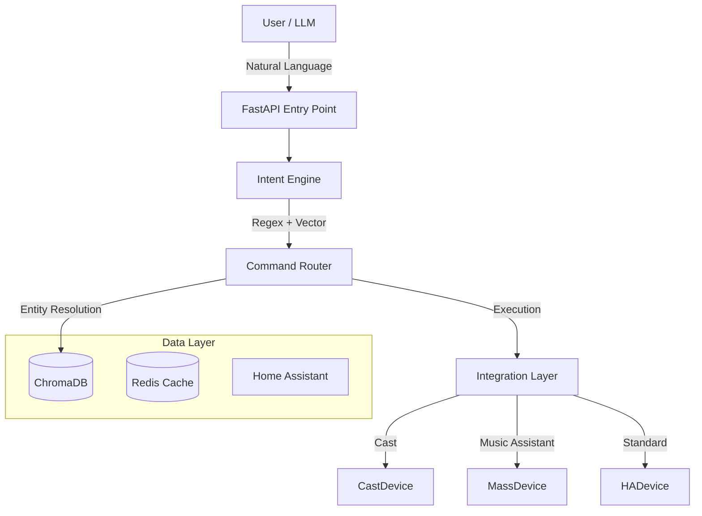

# SharedLLM System Architecture

## 1. System Overview

The **Unified RAG API** is an intelligent orchestration layer sitting between
the User (Voice/Chat) and the physical Smart Home (Home Assistant). It uses a
hybrid intent classification engine (Regex + Vector Search) to understand
natural language commands and route them to specific device integrations.

---

## 2. Core Components

### A. Lifecycle & Entry Point (`app/main.py`)

* **Framework**: FastAPI.
* **Startup**:
    1. `load_resources()`: Connects to Redis, ChromaDB, and loads the Embedding
       Model (`all-MiniLM-L6-v2`).
    2. `engine.load()`: Initializes the Intent Engine and vectorizes the
       Phrasebook.
    3. `refresh_db()`: Fetches all entities from Home Assistant (HA) and indexes
       them into ChromaDB for smart resolution.
    4. `start_scheduler()`: Starts the background timer/alarm loop.

### B. Semantic Router Pipeline (`app/intent_engine.py`)

The intent engine has evolved into a high-performance **Semantic Router** using `FastEmbed` (`BAAI/bge-small-en-v1.5`). It manages command routing through a tiered confidence model:

1. **Fast-Path Detection**: The query is embedded and compared against the `phrasebook.json` vector space.
2. **LLM Bypass (Sub-50ms)**: If the cosine similarity exceeds **0.85**, the intent is routed directly to the Execution Layer, bypassing LLM generation entirely.
3. **Slow-Path Augmentation**: For low-confidence queries, the Intent is used to fetch relevant RAG context before being dispatched to the LLM for reasoning.

### E. Tiered Memory & GraphRAG

Jarvis maintains two distinct memory layers to ensure context awareness without state bloat:

1. **Short-Term (Sliding Window)**: The last 10-15 messages are stored in Redis for immediate conversational continuity.
2. **Long-Term (User Facts)**: An asynchronous background task (`extract_user_facts`) monitors every conversation. It extracts durable preferences (e.g., "User likes blue lights") and saves them into a specialized `user_facts` RAG collection.
3. **Persona Injection**: Long-term facts are retrieved via semantic search and injected into the LLM system prompt, ensuring the AI "remembers" user-specific details across months of inactivity.

### F. Capability-Based Routing (Pre-Flight Intercept)

To prevent cascading failures, the Gateway performs a **Pre-Flight Capability Check**:

1. **Capability Map**: Intents are linked to required credentials in `main.py` (e.g., `media` -> `ha_token`).
2. **Intercept**: If a required field is missing or empty, the Gateway short-circuits the request.
3. **Redirection**: The user receives a persona-driven response explaining the missing integration and directing them to the **Identity Hub**.

The "Brain" that decides *what* to do with an Intent.

* **Media Router**: Orchestrates playback. Includes complex logic like **Smart
  Swap** (preferring high-quality audio sinks) and **SmartPowerSync** (managing
  physical TV power).
* **Lighting Router**: Handles `turn_on`, `turn_off`, `set_color`, and
  `set_brightness` for lights.
* **Timer/Alarm Router**: Manages active timers in Redis, supporting natural
  language ("Remind me in 10 minutes").
* **Productivity Router**: Directs Nextcloud-backed Calendar and Note
  operations.

#### Sequence: Smart Media Routing

```mermaid
sequenceDiagram
    participant User
    participant Router
    participant ChromaDB
    participant Factory
    participant MassDevice

    User->>Router: "Play Brandon Lake on Office TV"
    Router->>ChromaDB: Resolve "Office TV"
    ChromaDB-->>Router: Returns [CastDevice, MassSpeaker]

    rect rgb(20, 20, 20)
        note right of Router: Smart Policy Check
        Router->>Router: Intent is "Music"?
        Router->>Router: MassSpeaker available?
        Router->>Router: Priority: MassSpeaker > CastDevice
    end

    Router->>Factory: Get Handler(MusicAssistant)
    Factory-->>Router: MusicAssistantIntegration
    Router->>MusicAssistantIntegration: play_media("Brandon Lake")
    MusicAssistantIntegration->>MassDevice: Play Stream
```

### D. Integration Layer

The "Hands" that execute actions.

* **Design Pattern**: Strategy + Factory.
* **Role**: Encapsulates device-specific logic (e.g., "SmartPowerSync" for Cast
  devices).
* **Reference**: See [integrations.md](integrations.md).

---

## 3. Advanced Features

### Decompose & Compound Commands

The pipeline can split complex user instructions into sequential or parallel
steps.

* **Example**: "Turn off the lights and play my jazz playlist."
* **Logic**: `try_handle_compound_command` splits the query using "and" or
  "then" delimiters and dispatches them as separate pipeline tasks.

### Fast Path Orchestration

For high-confidence intents, the system bypasses the LLM generation phase
entirely to achieve command execution in under 200ms.

* **Trigger**: High confidence score from the Regex or Vector Intent Classifier
  (e.g., `watch_media` for "Watch Big Buck Bunny").
* **Mechanism**: The `pipeline.py` orchestrator creates a direct `tool_call`
  action plan.
* **Supported Intents**: `volume_*`, `nav_*`, `timer_*`, `watch_media`,
  `list_playlists`, `list_radio`.
* **Benefit**: drastic latency reduction for simple, repetitive commands.

### Capability-Based Routing (Pre-Flight Enforcement)

To ensure system stability and provide clear feedback, the Gateway performs a **Pre-Flight Capability Check** before fanning out requests to downstream services:

1. **Capability Map**: Every intent is linked to a set of required identity credentials (e.g., `turn_on` requires `ha_url` and `ha_token`).
2. **Pre-Flight Validation**: After intent classification, the Gateway evaluates the `ResolvedCredentials` of the user.
3. **Graceful Redirection**: If a required credential is missing or evaluates to an empty string, the Gateway halts execution and returns a persona-driven message guiding the user to the **Jarvis Identity Hub** to complete their setup.
4. **Credential Hygiene**: The Identity service strictly enforces that empty or whitespace-only inputs are coerced to `None`, ensuring that enforcement logic like `if not ha_token` is reliable.

### Multi-User Context

The system uses the `X-RAG-User` header to provide isolation:

* **Redis Cache**: Conversation history and temporary state are keyed by
  `user_id`.
* **Credentials**: Dynamically looks up `USER_{USERNAME}_{SETTING}` to allow
  individual Nextcloud or HA accounts.

### Background Alarms

Alarms are stored in Redis and monitored by a background thread started in
`main.py`. When an alarm triggers, it dispatches a high-priority notification
and plays an optional audio beep via the user's primary media player.

### State Management Strategy (Hybrid)

To balance search performance with data freshness, the system uses a **Hybrid
State Architecture**:

1. **ChromaDB (Discovery / Static)**:
    * Stores **Permanent Identity** (Name, Area, Capabilities, Integration).
    * **NO State**: It does NOT store whether a light is `on` or `off`.
    * **Usage**: Used during Entity Resolution (`smart_resolve_entity`) to find
      candidates based on semantic meaning (e.g., "The reading light").

2. **Live API (State / Dynamic)**:
    * Stores **Transient State** (On/Off, Volume, Playback Status).
    * **Usage**: Fetched via real-time API calls to Home Assistant during RAG
      generation (`get_ha_context`).
    * **Benefit**: Ensures answers ("Is the garage open?") are always 100%
      accurate without needing to update vector embeddings every second.

---

## 4. Self-Awareness & JIT Capability Discovery

To minimize LLM hallucinations and ensure precise tool usage, the system implements a **Just-In-Time (JIT) Capability Discovery** layer.

### A. Capability Indexing (`scripts/index_capabilities.py`)

The system programmatically extracts its own capabilities and indexes them into a specialized RAG collection (`system_capabilities`):

1. **Execution Schemas**: Pydantic models from the `execution` service (e.g., `LightControlRequest`, `NoteRequest`) are converted to JSON schemas.
2. **Intent Phrasebook**: Recognized intents and their natural language examples are extracted from `phrasebook.json`.
3. **RAG Sync**: These are pushed to the RAG service as searchable "Capability Documents".

### B. Context Injection (Gateway)

During the Gateway's **Slow Path**, a parallel RAG search is performed against the `system_capabilities` collection:

1. **Parallel Search**: While gathering device and document context, the Gateway also searches for "Capabilities" relevant to the user's query.
2. **Prompt Augmentation**: The retrieved schemas and intent definitions are injected into the system prompt under a `### System Capability Context` header.
3. **Constraint Mandate**: The system instructions strictly mandate that the LLM must use these injected schemas for all tool-call generation.

### C. Automated Clean-up

The system is capable of managing its own workspace through self-awareness. For example, the `Workspace Runtime` service provides a `/files/delete` endpoint, allowing the LLM (or automated maintenance scripts) to prune stale test files or temporary artifacts in a "self-cleaning" loop.

---

## 5. Key Services

* **Unified RAG**: Retrieval Augmented Generation for non-command queries.
  Indexes docs from Nextcloud and entity state from HA.
  * **Large Context Extraction**: Automatically extracts the core question from
    large pasted text blocks (e.g. PDFs or code snippets) before running the
    RAG vector search, preventing ChromaDB context limit errors.
  * **Document Ingestion (`document_index`)**: Users can prompt the AI to save
    text snippets or documents directly into NextCloud (`AI_Uploads` directory)
    which triggers an immediate re-index into the RAG database.
* **DeviceDB**: A specialized ChromaDB collection that stores "Device
  Documents". Defines `group_id`, `integration`, and `capabilities` for every
  smart device, enabling sophisticated group-aware logic (e.g.,
  SmartPowerSync).

---

## 5. Repo-Aware Nextcloud Assistance

For code assistance, Nextcloud should not be treated as the editable source of
truth for Git repositories. The better split is:

1. **Git workspace is authoritative for code state**
   * Active code edits, tests, diffs, and branch state should come from the
     checked-out local repository.
   * This avoids stale file snapshots, merge ambiguity, and accidental edits to
     synced artifacts rather than the real branch.

2. **Nextcloud is authoritative for workspace discovery and durable references**
   * The Storage service can treat directories like `/Code/SharedLLM` as
     registered workspaces for a user profile.
   * Folder metadata can provide a stable mapping such as:
     `display_name`, `nextcloud_path`, `local_path`, `git_remote`, `default_branch`,
     `sync_mode`.

3. **RAG indexes repository-adjacent documents, not raw Git state**
   * Good candidates: architecture docs, notes, design briefs, exported issues,
     handoff files, and snapshots intentionally stored in Nextcloud.
   * Bad candidates: every tracked source file on every sync, because Git is a
     better system of record for that content during active development.

### Recommended Architecture

* **Workspace Registry**
  * A first-pass registry now exists as `config/workspaces.json`.
  * It maps a durable storage path such as `/Code/SharedLLM` to a mounted local
    checkout path and records sync metadata.
  * The long-term target is a user-scoped registry API rather than a static
    file.

* **Capability Split**
  * **Storage service**: list/search registered workspace folders and retrieve
    non-code companion documents from Nextcloud, plus explicit provider
    writeback through the provider abstraction.
  * **Gateway**: detect coding intent and route code questions to the coding
    model.
  * **Workspace Runtime service**: inspect the mapped local checkout for
    `git status`, file reads, diffs, provider-folder scans, explicit file sync,
    and test execution inside the Docker stack.

* **Trigger Behavior**
  * If the user asks about code in a registered repo, prefer the local mapped
    checkout.
  * If the user asks for supporting documents, notes, or design context, search
    Nextcloud under that repo folder.
  * If the repo is not available locally, the system can fall back to
    Nextcloud-backed document assistance, but should clearly state that it is
    reasoning over synced files rather than a live Git worktree.

### Why this split works

* Git remains the canonical source for code correctness.
* Nextcloud remains useful for personal organization and cross-device discovery.
* The assistant can answer both "what changed in this branch?" and "what design
  note did I save next to this repo?" without conflating the two storage models.

### Current Implementation Status

The current `workspace_runtime` microservice is intentionally narrow. It
already exposes:

* workspace registry listing and resolution
* identity-backed filtering of registry workspaces by access policy
* limited system-scoped workspaces with admin bypass for broader capabilities
* safe file reads inside mounted workspaces
* local file writes with optimistic conflict checks
* `git status`, `git diff`, `git add`, `git commit`, and branch creation
* safe workspace file listing for context gathering
* designated-provider scans and explicit single-file sync to Nextcloud-backed
  workspace folders
* single-file orchestrated write -> sync -> commit -> optional push workflows
* chat-driven README generation that can inspect the mounted workspace, call
  the coding model, write `temp/README.md`, and sync it to the mapped provider
* targeted `pytest` execution

It does **not** yet provide full folder mirroring, non-text provider sync,
or pull/rebase orchestration. Those remain the next implementation steps rather
than implied capabilities.

---

## 6. Multi-Backend Content Indexing

The Storage service should not be designed as a Nextcloud-only bridge. Nextcloud
is only the first backend. The architecture should support multiple file stores
at the same time, including open-source and proprietary systems.

### Design Goals

* **Backend-agnostic**: The indexer reasons over normalized storage entries,
  not provider-specific objects.
* **Multi-source**: A user may have multiple active stores at once, such as
  Nextcloud, local disk mirrors, cloud drives, or document archives.
* **Capability-aware**: The system should classify what an item is and which
  internal tools can use it.
* **Incremental**: Discovery, classification, and enrichment should be able to
  run separately rather than forcing full deep parsing on every scan.

### Storage Pipeline

1. **Provider Layer**
   * Each backend implements a provider interface that returns normalized
     `StorageEntry` records.
   * Initial provider: Nextcloud via WebDAV.
   * Future providers can include local filesystems, S3-compatible stores,
     Dropbox, Google Drive, or SMB/NFS-backed mirrors.

2. **Discovery Layer**
   * Walk the provider tree and record stable metadata:
     `path`, `name`, `is_dir`, `size`, `mtime`, `content_type`.
   * This stage should stay cheap and deterministic.

3. **Classification Layer**
   * Infer content type from extension, MIME type, directory markers, sibling
     files, and naming patterns.
   * Examples:
     * `.git` folder => git repository
     * `.obsidian` folder => notes vault
     * `.mp3` => audio
     * `.epub` => ebook
     * `.docx`, `.pdf`, `.xlsx` => document family
     * `.png`, `.jpg`, `.svg` => image family

4. **Capability Mapping Layer**
   * Convert classification into a capability map describing what tools can use
     the item.
   * Example capability tags:
     * `full_text`
     * `structured_parse`
     * `table_extraction`
     * `code_navigation`
     * `git_metadata`
     * `ocr`
     * `transcription`
     * `thumbnail`
     * `playback`

5. **Consumer Layer**
   * Gateway, RAG, librarian flows, and media tools consume the index rather
     than guessing file behavior ad hoc.

### Content Families

The classifier should cover at least:

* **Repositories and source trees**
  * Git repositories, source code, scripts, configs, workflows
* **Notes and markdown**
  * Markdown notes, note exports, vault-style folders
* **Documents**
  * TXT, RTF, PDF, DOC/DOCX, ODT, PPT/PPTX, ODP, XLS/XLSX, ODS, CSV, TSV
* **Ebooks**
  * EPUB, MOBI, AZW, AZW3, FB2
* **Structured data**
  * JSON, YAML, XML, ICS, VCF, ENEX
* **Images**
  * PNG, JPG, JPEG, WEBP, GIF, BMP, TIFF, SVG, HEIC, AVIF
* **Audio**
  * MP3, M4A, WAV, FLAC, OGG, AAC
* **Video**
  * MP4, MKV, MOV, AVI, WEBM, M4V

### Why this matters

The librarian/guru layer should not merely know that a file exists. It should
know what sort of information it contains and which tools can derive value from
it. That makes the system extensible across multiple storage backends without
re-implementing heuristics in every downstream tool.
