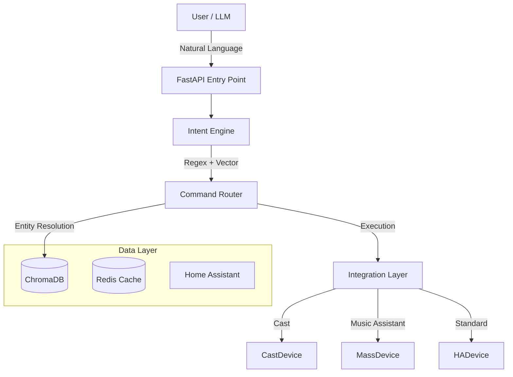

# System Architecture

## 1. System Overview
The **Unified RAG API** is an intelligent orchestration layer sitting between the User (Voice/Chat) and the physical Smart Home (Home Assistant). It uses a hybrid intent classification engine (Regex + Vector Search) to understand natural language commands and route them to specific device integrations.

---

## 2. Core Components

### A. Lifecycle & Entry Point (`app/main.py`)
*   **Framework**: FastAPI.
*   **Startup**:
    1.  `load_resources()`: Connects to Redis, ChromaDB, and loads the Embedding Model (`all-MiniLM-L6-v2`).
    2.  `engine.load()`: Initializes the Intent Engine and vectorizes the Phrasebook.
    3.  `refresh_db()`: Fetches all entities from Home Assistant (HA) and indexes them into ChromaDB for smart resolution.
    4.  `start_scheduler()`: Starts the background timer/alarm loop.

### B. Intent Engine (`app/intent_engine.py`)
Responsible for converting natural language (e.g., "Turn on the kitchen lights") into a structured Intent (e.g., `turn_on`). It uses a multi-stage pipeline:
1.  **Regex Override**: Checks `REGEX_INTENT_MAP` for exact pattern matches (Zero-Latency, 100% confidence).
2.  **Vector Search**: Embeds the user query and finds the nearest neighbor in the vectorized `phrasebook.json`. (Semantic matching).
3.  **Keyword Fallback**: If models fail, performs simple keyword matching.

### C. Command Router (`app/logic` & `app/domains/`)
The "Brain" that decides *what* to do with an Intent.
*   **Media Router**: Orchestrates playback. Includes complex logic like **Smart Swap** (preferring high-quality audio sinks) and **SmartPowerSync** (managing physical TV power).
*   **Lighting Router**: Handles `turn_on`, `turn_off`, `dim` for lights.
*   **Timer Router**: Manages active timers in Redis, supporting natural language ("Remind me in 10 minutes").

#### Sequence: Smart Media Routing

```mermaid
sequenceDiagram
    participant User
    participant Router
    participant ChromaDB
    participant Factory
    participant CastHandler
    participant TV
    participant CastDevice

    User->>Router: "Play Brandon Lake on Office TV"
    Router->>ChromaDB: Resolve "Office TV"
    ChromaDB-->>Router: Returns [CastDevice, MassSpeaker]
    
    rect rgb(20, 20, 20)
        note right of Router: Smart Policy Check
        Router->>Router: Intent is "Music"?
        Router->>Router: MassSpeaker available?
        Router->>Router: Priority: MassSpeaker > CastDevice
    end
    
    Router->>Factory: Get Handler(MusicAssistant)
    Factory-->>Router: MusicAssistantIntegration
    Router->>MusicAssistantIntegration: play_media("Brandon Lake")
    MusicAssistantIntegration->>MassDevice: Play Stream
```

#### Sequence: SmartPowerSync (Video)

```mermaid
sequenceDiagram
    participant User
    participant Router
    participant Factory
    participant CastHandler
    participant TV
    participant CastDevice

    User->>Router: "Play YouTube on Office Chromecast"
    Router->>Factory: Get Handler(Cast)
    Factory-->>Router: CastIntegration
    Router->>CastHandler: play_media()
    
    rect rgb(50, 20, 20)
        note right of CastHandler: SmartPowerSync
        CastHandler->>ChromaDB: Find Sibling TV in Group
        ChromaDB-->>CastHandler: found "Office TV"
        CastHandler->>TV: Check State (OFF?)
        CastHandler->>TV: Turn ON
        CastHandler->>CastHandler: Wait 4s
    end
    
    CastHandler->>CastDevice: Launch YouTube
```

### D. Integration Layer
The "Hands" that execute actions.
*   **Design Pattern**: Strategy + Factory.
*   **Role**: Encapsulates device-specific logic (e.g., "SmartPowerSync" for Cast devices).
*   **Reference**: See [integrations.md](integrations.md).

---

## 3. Data Flow: "Play Music" Example

1.  **Ingestion**: User says "Play Brandon Lake on Office TV".
2.  **Classification**: `IntentEngine` maps this to `play_media` (via vector similarity to "play music").
3.  **Routing**: `handle_media_command` receives the intent.
4.  **Resolution**:
    *   Router queries ChromaDB for "Office TV".
    *   Finds `media_player.office_tv_chrome` (Cast) and `media_player.mass_office_speaker` (Music Assistant).
    *   **Smart Swap Policy**: Since intent is "music", router swaps target to the Music Assistant entity.
5.  **Execution**:
    *   `IntegrationFactory` creates `MusicAssistantIntegration`.
    *   Handler cleans query to "Brandon Lake".
    *   Handler calls `mass.play_media` on Home Assistant.

---

## 4. Key Services
*   **Unified RAG**: Retrieval Augmented Generation for non-command queries (e.g., "How do I fix X?"). Indexes docs from Nextcloud and entity state from HA.
*   **DeviceDB**: A specialized ChromaDB collection that stores "Device Documents". Defines `group_id`, `integration`, and `capabilities` for every smart device, enabling sophisticated group-aware logic (e.g., SmartPowerSync).
