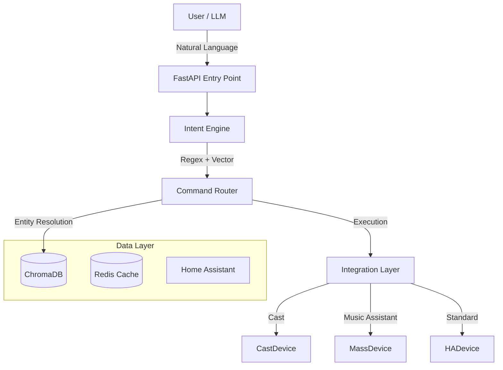

# SharedLLM System Architecture

## 1. System Overview

The **Unified RAG API** is an intelligent orchestration layer sitting between
the User (Voice/Chat) and the physical Smart Home (Home Assistant). It uses a
hybrid intent classification engine (Regex + Vector Search) to understand
natural language commands and route them to specific device integrations.

---

## 2. Core Components

### A. Lifecycle & Entry Point (`app/main.py`)

* **Framework**: FastAPI.
* **Startup**:
    1. `load_resources()`: Connects to Redis, ChromaDB, and loads the Embedding
       Model (`all-MiniLM-L6-v2`).
    2. `engine.load()`: Initializes the Intent Engine and vectorizes the
       Phrasebook.
    3. `refresh_db()`: Fetches all entities from Home Assistant (HA) and indexes
       them into ChromaDB for smart resolution.
    4. `start_scheduler()`: Starts the background timer/alarm loop.

### B. Intent Engine (`app/intent_engine.py`)

Responsible for converting natural language (e.g., "Turn on the kitchen lights")
into a structured Intent (e.g., `turn_on`). It uses a multi-stage pipeline:

1. **Regex Override**: Checks `REGEX_INTENT_MAP` for exact pattern matches
   (Zero-Latency, 100% confidence).
2. **Vector Search**: Embeds the user query and finds the nearest neighbor in
   the vectorized `phrasebook.json`. (Semantic matching).
3. **Keyword Fallback**: If models fail, performs simple keyword matching.

### C. Command Router (`app/logic` & `app/domains/`)

The "Brain" that decides *what* to do with an Intent.

* **Media Router**: Orchestrates playback. Includes complex logic like **Smart
  Swap** (preferring high-quality audio sinks) and **SmartPowerSync** (managing
  physical TV power).
* **Lighting Router**: Handles `turn_on`, `turn_off`, `set_color`, and
  `set_brightness` for lights.
* **Timer/Alarm Router**: Manages active timers in Redis, supporting natural
  language ("Remind me in 10 minutes").
* **Productivity Router**: Directs Nextcloud-backed Calendar and Note
  operations.

#### Sequence: Smart Media Routing

```mermaid
sequenceDiagram
    participant User
    participant Router
    participant ChromaDB
    participant Factory
    participant MassDevice

    User->>Router: "Play Brandon Lake on Office TV"
    Router->>ChromaDB: Resolve "Office TV"
    ChromaDB-->>Router: Returns [CastDevice, MassSpeaker]

    rect rgb(20, 20, 20)
        note right of Router: Smart Policy Check
        Router->>Router: Intent is "Music"?
        Router->>Router: MassSpeaker available?
        Router->>Router: Priority: MassSpeaker > CastDevice
    end

    Router->>Factory: Get Handler(MusicAssistant)
    Factory-->>Router: MusicAssistantIntegration
    Router->>MusicAssistantIntegration: play_media("Brandon Lake")
    MusicAssistantIntegration->>MassDevice: Play Stream
```

### D. Integration Layer

The "Hands" that execute actions.

* **Design Pattern**: Strategy + Factory.
* **Role**: Encapsulates device-specific logic (e.g., "SmartPowerSync" for Cast
  devices).
* **Reference**: See [integrations.md](integrations.md).

---

## 3. Advanced Features

### Decompose & Compound Commands

The pipeline can split complex user instructions into sequential or parallel
steps.

* **Example**: "Turn off the lights and play my jazz playlist."
* **Logic**: `try_handle_compound_command` splits the query using "and" or
  "then" delimiters and dispatches them as separate pipeline tasks.

### Fast Path Orchestration

For high-confidence intents, the system bypasses the LLM generation phase
entirely to achieve command execution in under 200ms.

* **Trigger**: High confidence score from the Regex or Vector Intent Classifier
  (e.g., `watch_media` for "Watch Big Buck Bunny").
* **Mechanism**: The `pipeline.py` orchestrator creates a direct `tool_call`
  action plan.
* **Supported Intents**: `volume_*`, `nav_*`, `timer_*`, `watch_media`,
  `list_playlists`, `list_radio`.
* **Benefit**: drastic latency reduction for simple, repetitive commands.

### Multi-User Context

The system uses the `X-RAG-User` header to provide isolation:

* **Redis Cache**: Conversation history and temporary state are keyed by
  `user_id`.
* **Credentials**: Dynamically looks up `USER_{USERNAME}_{SETTING}` to allow
  individual Nextcloud or HA accounts.

### Background Alarms

Alarms are stored in Redis and monitored by a background thread started in
`main.py`. When an alarm triggers, it dispatches a high-priority notification
and plays an optional audio beep via the user's primary media player.

### State Management Strategy (Hybrid)

To balance search performance with data freshness, the system uses a **Hybrid
State Architecture**:

1. **ChromaDB (Discovery / Static)**:
    * Stores **Permanent Identity** (Name, Area, Capabilities, Integration).
    * **NO State**: It does NOT store whether a light is `on` or `off`.
    * **Usage**: Used during Entity Resolution (`smart_resolve_entity`) to find
      candidates based on semantic meaning (e.g., "The reading light").

2. **Live API (State / Dynamic)**:
    * Stores **Transient State** (On/Off, Volume, Playback Status).
    * **Usage**: Fetched via real-time API calls to Home Assistant during RAG
      generation (`get_ha_context`).
    * **Benefit**: Ensures answers ("Is the garage open?") are always 100%
      accurate without needing to update vector embeddings every second.

---

## 4. Key Services

* **Unified RAG**: Retrieval Augmented Generation for non-command queries.
  Indexes docs from Nextcloud and entity state from HA.
  * **Large Context Extraction**: Automatically extracts the core question from
    large pasted text blocks (e.g. PDFs or code snippets) before running the
    RAG vector search, preventing ChromaDB context limit errors.
  * **Document Ingestion (`document_index`)**: Users can prompt the AI to save
    text snippets or documents directly into NextCloud (`AI_Uploads` directory)
    which triggers an immediate re-index into the RAG database.
* **DeviceDB**: A specialized ChromaDB collection that stores "Device
  Documents". Defines `group_id`, `integration`, and `capabilities` for every
  smart device, enabling sophisticated group-aware logic (e.g.,
  SmartPowerSync).

---

## 5. Repo-Aware Nextcloud Assistance

For code assistance, Nextcloud should not be treated as the editable source of
truth for Git repositories. The better split is:

1. **Git workspace is authoritative for code state**
   * Active code edits, tests, diffs, and branch state should come from the
     checked-out local repository.
   * This avoids stale file snapshots, merge ambiguity, and accidental edits to
     synced artifacts rather than the real branch.

2. **Nextcloud is authoritative for workspace discovery and durable references**
   * The Storage service can treat directories like `/Code/SharedLLM` as
     registered workspaces for a user profile.
   * Folder metadata can provide a stable mapping such as:
     `display_name`, `nextcloud_path`, `local_path`, `git_remote`, `default_branch`,
     `sync_mode`.

3. **RAG indexes repository-adjacent documents, not raw Git state**
   * Good candidates: architecture docs, notes, design briefs, exported issues,
     handoff files, and snapshots intentionally stored in Nextcloud.
   * Bad candidates: every tracked source file on every sync, because Git is a
     better system of record for that content during active development.

### Recommended Architecture

* **Workspace Registry**
  * Add a user-scoped registry of known code folders, starting with
    `/Code/SharedLLM`.
  * Each entry should map the Nextcloud folder to a local checkout path.

* **Capability Split**
  * **Storage service**: list/search registered workspace folders and retrieve
    non-code companion documents from Nextcloud.
  * **Gateway**: detect coding intent and route code questions to the coding
    model.
  * **Local agent/runtime**: inspect the mapped local checkout for `git status`,
    file reads, diffs, and test execution.

* **Trigger Behavior**
  * If the user asks about code in a registered repo, prefer the local mapped
    checkout.
  * If the user asks for supporting documents, notes, or design context, search
    Nextcloud under that repo folder.
  * If the repo is not available locally, the system can fall back to
    Nextcloud-backed document assistance, but should clearly state that it is
    reasoning over synced files rather than a live Git worktree.

### Why this split works

* Git remains the canonical source for code correctness.
* Nextcloud remains useful for personal organization and cross-device discovery.
* The assistant can answer both "what changed in this branch?" and "what design
  note did I save next to this repo?" without conflating the two storage models.
