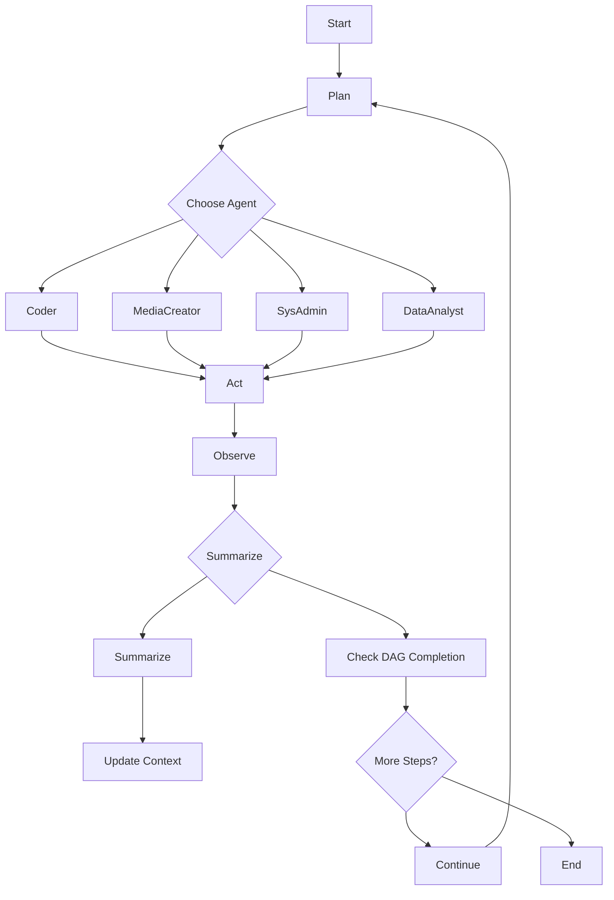

# Jarvis OS 2.0: Master Development Guide

## 1.1 Core Architecture Overview

Jarvis OS 2.0 transforms smart homes into Ambient Computing Environments for 7+ users. The dual-node architecture combines Application Node (Intel N150, 16GB RAM) and Inference Node (AMD Ryzen 7 5700G, NVIDIA RTX 4060, 32GB RAM) for optimal performance.

## 1.2 Three-Tier Request Hierarchy

Based on the system README.md, Jarvis utilizes a strict semantic routing hierarchy to balance speed and VRAM:

- **Tier 1 (FastPath):** Local semantic matcher using the nomic-embed-text-v1.5 embedding model. Bypasses the LLM entirely for common home automation queries (e.g., "Turn off lights"). Latency: `<100ms>`.
- **Tier 2 (Librarian):** Standard single-turn tool access via the LLM context. Latency: `1-3s>`.
- **Tier 3 (Raven):** Multi-step autonomous agent running up to 30 iterations in a sandboxed Workspace Runtime.

## 1.3 Network Architecture (Caddy)

The entire microservice architecture is strictly isolated behind a Caddy reverse proxy acting as the sole entry point on Port 80.

- **Frontend Traffic (`/*`):** Routed to the React ui:8008 container.
- **API Traffic:**
  - `/api/chat`, `/api/generate`, `/api/admin/raven`, `/v1/*`: Routed to gateway:11435>`.
  - `/execute`: Routed directly to execution:8003 (FastAPI API port). **Note:** media files (TTS audio, video) are served on the separate media port `:8888` by a lightweight HTTPServer thread running inside the execution container. This split was introduced to prevent the FastAPI event loop from blocking on large file transfers.
  - `/api/auth`, `/api/users`: Routed to identity:8001>`.
  - `/control_plane`: Routed to control_plane:8008>`.
This guarantees that frontend developers only ever need to talk to localhost:80 (or the server's IP) and Caddy securely routes the requests to the Docker internal network.

> [!IMPORTANT]
> **`ai-server` is a Docker-internal alias only — not a real hostname.** In docker-compose.yml, the extra_hosts block maps the label ai-server to the SharedLLM server's static IP so that containers can resolve it internally. The actual server hostname on the local network is ai.local (mDNS). Do not attempt to use ai-server as a hostname outside of Docker. If mDNS is unavailable, fall back to the static IP configured in EXECUTION_EXTERNAL_HOST in your .env.

## 2. Integration Architecture

To ensure the frontend remains clean, modular, and future-proof, **we will not hardcode specific integrations into the UI**. Instead, we will implement a decoupled, capability-driven architecture.

### 2.1 Backend Plugin Registry & Dynamic Forms

* **Abstract Providers:** The backend utilizes base classes (e.g., ChoreProvider, MediaProvider).
* **Zero Frontend Debt:** The backend exposes GET /api/integrations/available. This returns a JSON schema of required auth fields. The /admin/integrations React page dynamically generates the configuration forms based on these schemas.

### 2.2 Normalized Capability Widgets

The frontend uses generic Capability Widgets (MediaWidget, ChoreWidget). The backend normalizes the raw API response from any integration into a standard JSON payload before sending it to the UI via WebSockets (/ws/capabilities).

## 3. Key Integration Points

### 3.1 Music Assistant (MASS) & Home Assistant

* **Backend Reality:** execution/handlers/media.py utilizes resolve_mass_entity() to natively call the HA music_assistant service via MASS_CONFIG_ENTRY_ID. The FastAPI route /execute/media/play maps to the mediaplayrequest tool.
* **Jarvis OS 2.0 Enhancements:**
  * **Active Media Widget (Cyan Glow):** When MASS initiates playback, this widget drops into the Capability Matrix.
  * **Deep UI Linking:** Because MASS returns robust JSON, the React UI will natively display high-res Album Cover Art, the upcoming MASS Queue, and provide tactile transport controls querying /execute/media/transport.

### 3.2 Audiobookshelf (ABS)

* **Backend Reality:** execution/handlers/audiobookshelf.py directly interfaces with the ABS API bypassing HA for metadata. It features complex logic to track duration, currentTime, and resume progress (_handle_resume, _handle_progress). It pipes the direct MP4 stream back to HA via play_media. Maps to the audiobookshelfrequest tool.
* **Library Search (2026-06-25):** The gateway endpoint `GET /api/media/audiobookshelf/search?q=<query>&limit=<n>` first fetches `/api/libraries` to discover the book library ID, then searches via `/api/libraries/{book_library_id}/items?query=<q>&limit=<n>`. If no library matches, falls back to external metadata (iTunes books/podcasts, Audnexus authors). Library results include `play_url` (stream URL with JWT token) and `progress` (resume state). Response format: `{"books": [...], "podcasts": [...], "authors": [...], "total": <n>}`.
* **Jarvis OS 2.0 Enhancements:**
  * **"Continue Reading" Widget:** Leverages the precise tracking in _handle_progress. Shows the exact progress percentage and a beautifully formatted _format_time string (e.g., "3h 15m remaining") underneath the book cover. Tapping the widget instantly triggers _handle_resume on the room's default speaker.
  * **Frontend Media Picker:** `Media.tsx` renders library search results with `duration_formatted` display. External metadata results show source badges (`book`, `podcast`, `author`). Both paths trigger browser local playback via the `<audio>` element.

### 3.3 Raven Autonomous Engine, Ops & The Control Plane (OpenCode Architecture)

* **Backend Reality (The OpenCode Paradigm):**
  * **Isolated Workspace Container:** Borrowing heavily from OpenCode/OpenDevin architecture, Raven does not execute code directly on the host. It operates exclusively inside the workspace_runtime Docker container. This creates a reproducible, sandboxed environment. To prevent permission drift, the container runs under a dynamic USER_ID:GROUP_ID mapping that matches the host user.
  * **Volume Mount Segregation:** To maintain security without forcing re-authentication on every container spin-up, Raven utilizes strict volume mount separation. The project code (/workspace) is mounted separately from the authentication configuration (/root/.local/share/opencode), ensuring the LLM cannot accidentally commit or leak its own API keys.
  * **Stateful Bash Execution (PTY):** Unlike simple subprocess.run calls, Raven maintains a persistent pseudoterminal (PTY) session (often via pexpect or similar native OS bindings). This means directory changes (cd) and exported environment variables persist across sequential tool executions, exactly how a human experiences a terminal.
  * **Unified Event Stream (Action-Observation Loop):** The core loop is strictly formalized into an Event Stream. Every LLM decision is an Action (e.g., RunCommand, WriteFile), and the environment's response is an Observation (e.g., CommandOutput, FileRead). These JSON events are piped directly into a Redis PubSub channel (raven:events:{id}) to power the frontend UI in real time.
  * **Trajectory Logging:** Every mission automatically generates a trajectory.jsonl file inside the workspace's hidden folder (e.g., .raven/). This JSON-Lines file acts as a black box flight recorder, allowing admins to perfectly replay the LLM's thought process if an autonomous operation fails.
  * **Dual Operating Modes (Plan vs. Build):** Raven supports two distinct execution contexts:
    * **Plan Mode (Read-Only):** The agent can parse ASTs, run ripgrep (handle_workspace_search), and analyze logs, but file writes and shell execution are blocked. Used for triage and scoping.
    * **Build Mode (Read/Write):** The agent gains access to difflib.SequenceMatcher for fuzzy file patching (handle_workspace_patch), shell command execution, and Git controls.
  * **Provider-Agnostic Routing:** The engine is not hardcoded to a specific vendor. Via the LLMInfoRequest tool and the Gateway router, Raven can seamlessly pivot between local models (TurboQuant/Ollama), OpenRouter, or direct API providers depending on the task complexity and current VRAM availability.
  * gateway/agent_loop.py manages multi-step missions, utilizing Redis Checkpoints (raven:checkpoint:{mission_id}) and _compress_context() to prevent token bloat.
  * execution/handlers/git.py securely injects tokens (github_token) and dynamically prevents LLM branch hallucinations.
  * The Control Plane (control_plane/main.py): Runs on port 8008 and connects directly to the host Docker socket. Secured via X-Internal-Secret, it allows the LLM and the UI to securely fetch logs, restart microservices (/api/restart/sharedllm_gateway), and execute shell commands inside running containers (/api/containers/.../exec).
* **Jarvis OS 2.0 Enhancements:**
  * **Raven Ops Panel (Admin Center):** Subscribes to the Redis stream (raven:mission:stream:{mission_id}) and transforms raw JSON logs into a sleek, vertical Operations Timeline. It also natively integrates with the Control Plane, providing UI buttons for Admins to view live Docker logs or restart crashed services directly from the React dashboard. Admins can toggle Raven between Plan and Build modes directly from this panel.
  * **Interactive Commits:** When Raven executes /execute/git (git_commit), the UI generates a "Commit Card" linking directly to the GitHub PR. Admins can view a visual diff natively before allowing Raven to push.

## 3.4 Raven 2.0 (Fable 5-Worthy) Autonomous Harness

### Core Architecture

* **Temporal DAG Execution:** Long-running tasks are now Directed Acyclic Graphs (DAGs) of state transitions, persisting in Redis. If a worker crashes at iteration 42, it resumes exactly where it left off. This enables truly long-duration tasks like full codebase migrations or video rendering that can span multiple days.

* **Hierarchical Swarm Routing:** The monolithic AgentLoop is replaced by an Orchestrator Node that delegates to specialized sub-agents: Coder, MediaCreator, SysAdmin, and DataAnalyst. They share a central RAG memory bank but use smaller, specialized local models to save VRAM.

* **VRAM-Aware Context Paging:** To handle strict memory constraints, Raven 2.0 uses "Context Splitting." When the action log exceeds the context window, it spawns a synchronous background thread to summarize memory into a Workspace Context Vector in ChromaDB, keeping the active context window hyper-lean.

* **Multi-Modal Creation Pipelines:** The workspace runtime extends beyond text files to include:
  * **TTS/STT:** Direct binding to local Kokoro/Whisper microservices for audio asset generation
  * **Graphics:** Integration with local ComfyUI/Stable Diffusion API for dashboard icons, background art, and visual notifications
  * **Data Management:** Autonomous Nextcloud sync with content-aware deduplication

### Architecture Blueprint

* **Core Substrate Redesign:**
  * **State Machine:** Implemented as langgraph or lightweight asynchronous state machine in `services/gateway/state_machine.py`. The global INFERENCE_LOCK is removed.
  * **Event-Driven Pauses:** Long-running tasks (Docker container builds, video rendering) yield worker threads back to the pool, persisting in "WAITING_ON_EXTERNAL_SYSTEM" state in Redis.
  * **Tool Registration Registry:** Abstracted `ALLOWED_TOOLS` into dynamic registry using Redis PubSub. Services broadcast capabilities on startup, enabling Raven to discover new tools without gateway updates.

* **Tiered Queue System:** Librarian fast-path bypasses Raven's heavy queue, ensuring UI interactions remain sub-200ms while Raven compiles code in the background.

* **VRAM Spillover Guardrails:** Proactively monitors `/api/ps` VRAM usage. If constrained, Raven automatically downgrades active context window size or pauses until Librarian tasks complete.

### Swarm Agent Implementation

* **Orchestrator:** `services/gateway/orchestrator_v2.py` - Task decomposition, delegation, RAG context retrieval
* **Coder Agent:** Code generation, testing, refactoring using strict TDD
* **MediaCreator Agent:** Multi-modal asset generation (TTS, images, video)
* **SysAdmin Agent:** Container management, system administration
* **DataAnalyst Agent:** Data processing, analysis, reporting

### Enhanced Workspace Runtime

* **Media Workspace Mounts:** `docker-compose.yml` and `services/workspace_runtime/main.py` updated for binary asset manipulation (images, audio)
* **Creation Tools:** Added to `services/execution/`:
  * `GraphicGenerationRequest`: Generates images via local SD endpoint, saves to Nextcloud
  * `AudioGenerationRequest`: Generates TTS, saves `.wav`, orchestrates MediaPlayRequest
  * Enhanced `WorkspaceShellRequest`: Async mode returns job ID and webhook on completion

### Guardrail Directives

* **No Assumptions:** All service calls use multi-approach validation (different parameter names, HTTP methods, retry strategies)
* **Multi-Approach Validation:** If service returns 500, agent explicitly uses DockerLogsRequest on that service before retry
* **Prompt Engineering:** Rewritten `services/gateway/prompts.py` for swarm mentality with strict constraints

## 4. Communication Systems

### 4.1 Nextcloud Talk Integration

* **Backend Reality:**
  * execution/main.py hosts /execute/tts which utilizes the local Kokoro ONNX model (kokoro-v1.0.onnx) for lightning-fast voice generation.
  * execution/handlers/talk.py handles the talkrequest. It reads chat via /ocs/v2.php/apps/spreed/... and posts via action="send".
  * Its send_voice action integrates directly with the TTS engine. It generates an audio payload, uploads it to Talk Uploads, and posts it as a native voice message inside a Nextcloud Talk chat.
  * *Deep-Dive Architecture Finding (Webhooks):* To eliminate fragile polling loops, the system implements a native Nextcloud Talk Bot (POST /api/talk/webhook). When a user @mentions Jarvis in a Nextcloud chat, Nextcloud fires a webhook directly to the Gateway, instantly enqueueing an inference job.

* **Jarvis OS 2.0 Enhancements:**
  * **Jarvis as an Interactive Chat Bot:** Jarvis constantly monitors configured Nextcloud Talk channels. Users can @Jarvis in their Nextcloud app to trigger agent logic externally. Taking inspiration from classic IRC bots, Jarvis will also host interactive chat games directly in the channel. This includes Bible Trivia, simple number/letter games for kids, and educational, Bible-oriented games to assist children with math and reading.
  * **Remote Ambient Voice Notifications:** Instead of sending standard text push notifications to the user's Android phone, Jarvis uses the Kokoro TTS pipeline to drop a native Voice Note directly into the user's Nextcloud Talk app (e.g., "Sir, the garage door has been left open.").
  * **The Smart Inbox & Native Chat Client:** Moves local IMAP/Talk communication into a card-based widget showing AI-triaged summaries. Crucially, the Neon Glass UI allows this specific widget to expand into a Full-Screen View, giving the user a native Nextcloud Talk chat experience directly within Jarvis OS. A future, dedicated Native Chat Client app is planned, offering a full-screen, high-fidelity chat experience with Jarvis and other household members without leaving the dashboard.

## 5. NotebookLM-Style Context & Nextcloud Notes

* **Backend Reality:**
  * handlers/note.py directly interfaces with Nextcloud WebDAV to execute the noterequest tool. Crucially, it features a sync_rag action that recursively walks note directories and pipes them into the local RAG indexing pipeline.
  * handlers/calendar.py directly interfaces with Nextcloud CalDAV (via calendarrequest) to parse dates (dateparser) and inject events.
  * *Deep-Dive Architecture Finding:* The system also runs an asynchronous background task (extract_user_facts) that continuously monitors conversation history in Redis. It autonomously extracts durable preferences and saves them into a specialized user_facts ChromaDB collection.

## 6. State Machine & DAG Implementation

### Core State Graph Design

### State Transitions

1. **Plan:** Analyze task, decompose into sub-tasks, select appropriate agent
2. **Act:** Execute agent-specific tools and operations
3. **Observe:** Capture results, detect failures, gather tool outputs
4. **Reflect:** Evaluate progress, identify next steps
5. **Summarize:** Update action log, persist state to Redis, check for completion
6. **Continue/End:** Loop back to Plan or terminate

### Redis Checkpointing

Each state transition persists:
- Current state and parameters
- Action log summaries (last 20 entries)
- External tool results
- VRAM context vectors
- Estimated completion time

### Scalability & Resilience

* **Parallel Execution:** Sub-tasks from different agents can run simultaneously
* **Fault Tolerance:** Any node failure triggers DAG-based state restoration
* **Resource Management:** VRAM-aware agent selection based on current memory pressure
* **Context Management:** Automatic summarization and ChromaDB vector storage

## References

- jarvis_os_2_master_guide_detailed.md: Complete technical implementation details (2,029 lines)
- jarvis_os_2_ui_wireframes.md: UI wireframes and component specifications
- docs/roadmap.md: Feature roadmap and progress tracking
- RAVEN_AUDIT_BLUEPRINT.md: Raven 2.0 architectural overhaul and hardening blueprint

