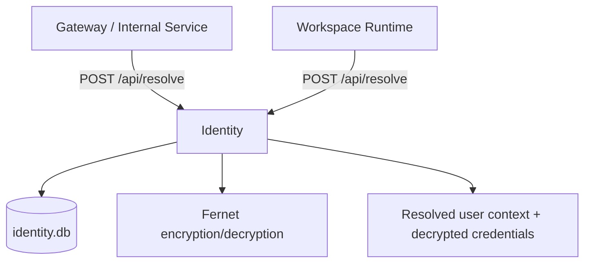
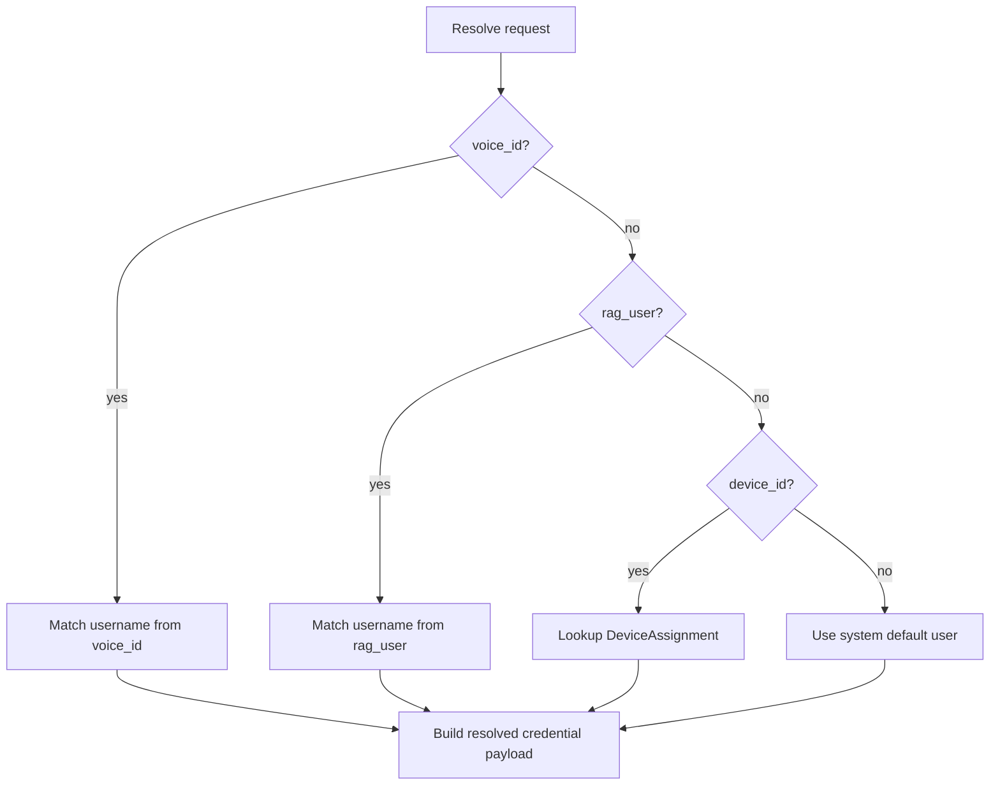

# Identity Service

The Identity service is the credential and caller-resolution authority for the
SharedLLM stack.

It owns the user database, decrypts stored credentials for internal callers,
and resolves a request into a concrete user context that downstream services
can trust.

## What It Does Today

- stores user records in SQLite
- encrypts HA, Nextcloud, GitHub, GitLab, and Audiobookshelf secrets at rest
- resolves callers by `voice_id`, `rag_user`, `device_id`, or system-default
  fallback
- returns decrypted service credentials to trusted internal callers
- exposes CRUD APIs for users and device assignments
- stores a DB-backed `is_admin` flag for policy decisions in other services
- exposes an internal admin endpoint to promote or demote a user in the DB

## Service Schematic

## Resolution Flow

## Data Model

### `User`

- `username`: stable identity key
- `display_name`: human-friendly label
- `is_admin`: DB-backed admin flag for policy decisions
- `is_system_default`: fallback identity when no caller-specific match exists
- `api_key`: optional external API key for CRUD-style user access
- `github_*` fields: optional GitHub or GitHub Enterprise credentials
- `gitlab_*` fields: optional GitLab credentials
- `*_enc` fields: encrypted secrets stored at rest

### `DeviceAssignment`

- maps a `device_id` to a `user_id`
- used when the caller is inferred from device context rather than username

## Current API Surface

- `POST /api/resolve`
  Internal-only caller resolution and credential decryption.
- `GET /api/users`
  List users with API-key auth.
- `POST /api/users`
  Create users with API-key auth.
- `DELETE /api/users/{username}`
  Delete a user with API-key auth.
- `POST /api/device-assignments`
  Create a device-to-user assignment with API-key auth.
- `GET /api/device-assignments`
  List device assignments with API-key auth.
- `DELETE /api/device-assignments/{device_id}`
  Delete a device assignment with API-key auth.
- `POST /api/admin/seed`
  Internal-only reseed from legacy `.env`.
- `POST /api/admin/users/{username}/admin`
  Internal-only DB update for admin promotion or demotion.

## Current Safety Model

- internal inter-service calls require `X-Internal-Secret`
- external CRUD APIs require bearer API-key auth
- secrets are encrypted at rest and only decrypted during trusted resolution
- the service returns identity context, but it should not be treated as a
  general-purpose secret distribution API for arbitrary callers

## Credential Surface

The current resolved credential payload can include:

- Home Assistant: `ha_url`, `ha_token`
- Nextcloud: `nextcloud_url`, `nextcloud_user`, `nextcloud_pass`
- GitHub: `github_url`, `github_user`, `github_token`
- GitLab: `gitlab_url`, `gitlab_user`, `gitlab_token`
- Audiobookshelf: `audiobookshelf_url`, `audiobookshelf_user`,
  `audiobookshelf_pass`

## What It Is Meant To Do

- remain the source of truth for user identity and secret material
- hold DB-backed authorization flags such as `is_admin`
- own future workspace-role and provider-binding metadata instead of pushing
  user-specific access control into static JSON files
- eventually replace environment-seeded user state with explicit admin-managed
  records
