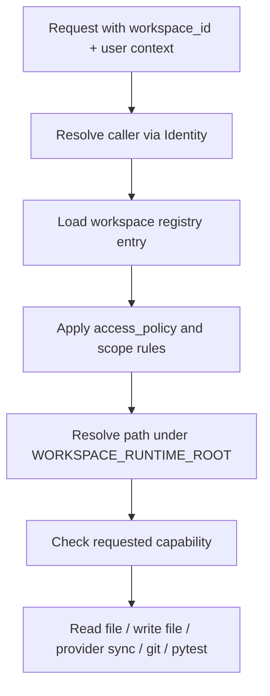

# Workspace Runtime Service

The Workspace Runtime service is the first concrete agentic substrate for
SharedLLM's workspace-centric workflows.

It provides a safe, mounted-workspace interface for:

- listing registered workspaces
- resolving a workspace to a real local path
- reading files inside that workspace
- writing files inside user-authorized workspaces
- reporting `git status`
- returning `git diff`
- staging files with `git add`
- creating commits with identity-derived Git author metadata
- creating branches for isolated workspace changes
- pushing branches with identity-resolved Git credentials when needed
- scanning a workspace's designated provider folder
- syncing a local file into that designated provider path
- executing an orchestrated write -> sync -> test -> commit -> push workflow
- running targeted `pytest` commands

## What It Does Today

Implemented today:

- read-only workspace registry loading
- user-scoped workspace filtering through the Identity service
- policy-based workspace visibility through `access_policy` rather than
  hardcoded usernames
- limited `system` workspaces with capability restrictions unless the resolved
  caller is admin
- safe workspace resolution under the mounted root
- read-only file access
- guarded text file writes with optional `expected_sha256` conflict checks
- `git status`, `git diff`, `git add`, `git commit`, branch creation, and push
- provider-folder scans and explicit file sync via the Storage provider layer
- workflow orchestration for incremental local edit -> provider sync -> git
  lifecycle execution
- targeted `pytest` execution

## Service Schematic

```mermaid
flowchart TD
    Gateway[Gateway / Internal Caller] -->|X-Internal-Secret| WorkspaceRuntime
    WorkspaceRuntime --> Registry[config/workspaces.json]
    WorkspaceRuntime --> Identity[Identity /api/resolve]
    WorkspaceRuntime --> MountedWorkspace[/workspace/...]
    Identity --> GitIdentity[Resolved GitHub or GitLab credentials]
    Identity --> ProviderIdentity[Resolved Nextcloud credentials]
    MountedWorkspace --> Git[git status / git diff / git add / git commit / git branch / git push]
    WorkspaceRuntime --> Storage[Storage /providers/list /providers/write]
    MountedWorkspace --> Pytest[python -m pytest]
```

## Request Flow



## Registry Schema

Each workspace entry can currently define:

- `id`: stable workspace identifier
- `display_name`: human-friendly label
- `local_path`: mounted path relative to `WORKSPACE_RUNTIME_ROOT`
- `nextcloud_path`: discovery path used by storage-side tooling
- `git_remote`: expected Git remote name
- `default_branch`: default branch for future Git lifecycle actions
- `sync_mode`: current authority model
- `access_policy`: `authenticated` or `admin_only`
- `scope`: `user` or `system`
- `capabilities`: optional override list for allowed operations

## Current API Surface

- `GET /health`
- `GET /workspaces`
- `POST /workspace/resolve`
- `POST /files/read`
- `POST /files/write`
- `POST /git/status`
- `POST /git/diff`
- `POST /git/add`
- `POST /git/commit`
- `POST /git/branch/create`
- `POST /git/push`
- `POST /provider/scan`
- `POST /provider/sync/file`
- `POST /workflow/write-sync-commit`
- `POST /tests/pytest`

## Access Model

- `authenticated` workspaces require a resolved Identity user
- `admin_only` workspaces require `is_admin=True` from Identity
- `system` workspaces can expose a narrower capability set than normal
  workspaces
- admin users can bypass system capability limits when the request should be
  allowed at the identity-policy layer

## What It Is Meant To Do

This service is intentionally broader than code-only execution. Its target role
is to operate on mounted workspaces as a whole, including:

- code repositories
- notes and supporting documents
- synthesized master documents
- metadata sidecars
- local enrichment flows such as transcription or document generation

## Safety Model

- All workspace paths must resolve under `WORKSPACE_RUNTIME_ROOT`.
- Registry entries declare access policy such as `authenticated` or
  `admin_only`, while admin status comes from the Identity service.
- Registry entries can declare `scope: "system"` and a reduced `capabilities`
  list for more sensitive workspaces.
- Provider sync resolves credentials through Identity and writes through the
  Storage provider abstraction rather than embedding provider-specific logic in
  the runtime.
- Relative file reads and pytest targets are checked for path traversal.
- The service is intended for internal use and requires `X-Internal-Secret`
  for non-health endpoints.

## Current Scope

Implemented:

- read/write file access
- policy-based workspace resolution
- git inspection and controlled local git mutation
- provider scan and explicit provider file sync for mapped workspaces
- orchestrated workflow execution for single-file edit/sync/commit/push flows
- targeted test execution

Not yet implemented:

- workspace registry mutation APIs
- direct Gateway orchestration against these endpoints
- DB-backed workspace registry records
- document or note mutation APIs
- provider writeback after local authoritative changes
  only text file sync is implemented today, not broader folder mirroring

## Remaining Work

- move workspace definitions from static JSON into a DB-backed registry
- extend file mutation support beyond direct text writes
- add Git fetch/pull/rebase operations with remote-auth controls
- expand provider sync from single-file text writeback into broader workspace mirroring where needed
- let the Gateway orchestrate this service directly for agentic tasks
- add note, document, metadata, and transcription operations under the same
  workspace policy model
- add explicit audit logging for write-side workspace actions

See also:

- [docs/workspace_runtime.md](/home/jeremiah/Summers Drive/Code/SharedLLM/docs/workspace_runtime.md)
