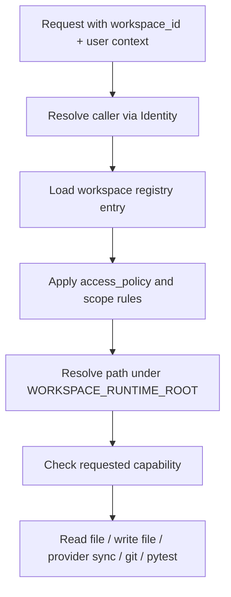

# Workspace Runtime Service

The Workspace Runtime service is the first concrete agentic substrate for
SharedLLM's workspace-centric workflows.

It provides a safe, mounted-workspace interface for:

- listing registered workspaces
- resolving a workspace to a real local path
- reading files inside that workspace
- listing files inside that workspace for context gathering
- writing files inside user-authorized workspaces
- reporting `git status`
- returning `git diff`
- staging files with `git add`
- creating commits with identity-derived Git author metadata
- creating branches for isolated workspace changes
- pushing branches with identity-resolved Git credentials when needed
- scanning a workspace's designated provider folder
- syncing a local file into that designated provider path
- executing an orchestrated write -> sync -> test -> commit -> push workflow
- running targeted `pytest` commands

## What It Does Today

Implemented today:

- read-only workspace registry loading
- user-scoped workspace filtering through the Identity service
- policy-based workspace visibility through `access_policy` rather than
  hardcoded usernames
- limited `system` workspaces with capability restrictions unless the resolved
  caller is admin
- safe workspace resolution under the mounted root
- read-only file access
- guarded text file writes with optional `expected_sha256` conflict checks
- `git status`, `git diff`, `git add`, `git commit`, branch creation, and push
- provider-folder scans and explicit file sync via the Storage provider layer
- workflow orchestration for incremental local edit -> provider sync -> git
  lifecycle execution
- targeted `pytest` execution

## Service Schematic

```mermaid
flowchart TD
    Gateway[Gateway / Internal Caller] -->|X-Internal-Secret| WorkspaceRuntime
    WorkspaceRuntime --> Registry[config/workspaces.json]
    WorkspaceRuntime --> Identity[Identity /api/resolve]
    WorkspaceRuntime --> MountedWorkspace[/workspace/...]
    Identity --> GitIdentity[Resolved GitHub or GitLab credentials]
    Identity --> ProviderIdentity[Resolved Nextcloud credentials]
    MountedWorkspace --> Git[git status / git diff / git add / git commit / git branch / git push]
    WorkspaceRuntime --> Storage[Storage /providers/list /providers/write]
    MountedWorkspace --> Pytest[python -m pytest]
```

## Request Flow

```mermaid
flowchart TD
    Start[Request with workspace_id + user context] --> ResolveIdentity[Resolve caller via Identity]
    ResolveIdentity --> LoadRegistry[Load workspace registry entry]
    LoadRegistry --> Policy[Apply access_policy and scope rules]
    Policy --> PathCheck[Resolve path under WORKSPACE_RUNTIME_ROOT]
    PathCheck --> Capability[Check requested capability]
    Capability --> Execute[Read file / write file / provider sync / git / pytest]
```

## Registry Schema

Each workspace entry can currently define:

- `id`: stable workspace identifier
- `display_name`: human-friendly label
- `local_path`: mounted path relative to `WORKSPACE_RUNTIME_ROOT`
- `nextcloud_path`: discovery path used by storage-side tooling
- `git_remote`: expected Git remote name
- `default_branch`: default branch for future Git lifecycle actions
- `sync_mode`: where the files live (see "Storage modes" below)
- `access_policy`: `authenticated` or `admin_only`
- `scope`: `user` or `system`
- `capabilities`: optional override list for allowed operations

## Current API Surface

- `GET /health`
- `GET /workspaces`
- `POST /workspace/resolve`
- `POST /files/read`
- `POST /files/list`
- `POST /files/write`
- `POST /git/status`
- `POST /git/diff`
- `POST /git/add`
- `POST /git/commit`
- `POST /git/branch/create`
- `POST /git/push`
- `POST /provider/scan`
- `POST /provider/sync/file`
- `POST /provider/sync/directory`
- `POST /provider/sync/workspace` (two-way or one-way Nextcloud sync)
- `POST /provider/sync/workspace/reset` (forget the sync history)
- `POST /files/upload` (multipart: many files and whole folder trees)
- `POST /files/move`
- `POST /workflow/write-sync-commit`
- `POST /tests/pytest`

## Storage modes (git, Nextcloud, or both)

`sync_mode` decides where a workspace's files live:

| `sync_mode` | Files live in | Nextcloud sync |
|---|---|---|
| `local_git_authoritative` (or legacy `git`) | a git checkout | optional one-way **push** to `nextcloud_path` (manual, or after each git pull when `auto_backup_enabled`) |
| `nextcloud` | Nextcloud only, no git | **two-way** with `nextcloud_path` |
| `git_and_nextcloud` | a git checkout | **two-way** with `nextcloud_path`; `.git` itself never syncs |

The Nextcloud modes require `nextcloud_path`; create/update returns 400
without it. Credentials are the caller's Identity integration
(`nextcloud_url`, `nextcloud_user`, `nextcloud_pass`). A missing credential is
an error naming the missing key, never a silent skip.

The sync runs inside this service (`nextcloud_sync.py`, WebDAV), because this
is the only service that mounts the workspace files. The Storage service's
`/providers/mirror` cannot see them.

**How two-way sync decides.** Every synced path is recorded in the
`workspacesyncentry` table: size, mtime, sha256 and the Nextcloud etag. On the
next run:

- changed on one side → copied to the other
- changed on both → the local file is kept and the Nextcloud version is saved
  beside it as `name (conflicted copy YYYY-MM-DD HHMMSS).ext`; both are
  uploaded, so nothing is lost
- deleted on one side and unchanged on the other → deleted on the other
- deleted on one side but edited on the other → the edit wins
- new on both sides with identical bytes → just recorded

`push` and `pull` make one side authoritative. They only ever delete paths an
earlier sync recorded. The workspace's `excludes` are shell globs, and `.git`
is always excluded. Safety stops:

- a listing error aborts the sync instead of reading as "empty folder"
- a previously synced Nextcloud folder that has vanished stops the sync
  instead of deleting every local file
- a folder is only deleted remotely when it holds nothing, including excluded
  files we never synced

Changing `nextcloud_path` clears the history and the linked account.

**When it runs.**

- On demand: `POST /provider/sync/workspace {workspace_id, direction?: both|push|pull, dry_run?}`
- About 5 s after any write, upload, move or delete in a Nextcloud-mode
  workspace (debounced)
- After git pulls
- Every `WORKSPACE_NEXTCLOUD_SYNC_INTERVAL_SECONDS` (default 300; 0 turns the
  loop off) for every Nextcloud-mode workspace

Unattended runs use the account of `sync_owner`, the first user who synced,
falling back to `owner_user`. The outcome is stored in `last_sync_at`,
`last_sync_status` (`ok` / `conflicts` / `error`) and `last_sync_error`. Each
WebDAV request times out after `WORKSPACE_NEXTCLOUD_TIMEOUT_SECONDS`
(default 120).

## Uploads (many files, whole folders)

`POST /files/upload` is `multipart/form-data` and works in every `sync_mode`.
Its form fields:

- `workspace_id`
- `relative_path`: the target folder
- `overwrite`: default true
- repeated `files` + `paths` pairs: each path is relative to the target, e.g.
  `photos/2024/a.jpg`, so a folder imports recursively at any depth
- repeated `dirs`: folders to create even when empty

Files stream to disk and replace any existing file atomically. Paths with `..`
or a `.git` segment are refused per file, with the reason in `errors`. A
request over `WORKSPACE_UPLOAD_MAX_BYTES` (default 1 GiB) gets a 413. The
Gateway (`/api/workspaces/files/upload`) streams the body through unbuffered
and passes the caller's identity in `X-Workspace-User-Context`. The UI batches
large selections: at most 200 files or 64 MB per request.

## Access Model

- `authenticated` workspaces require a resolved Identity user
- `admin_only` workspaces require `is_admin=True` from Identity
- `system` workspaces can expose a narrower capability set than normal
  workspaces
- admin users can bypass system capability limits when the request should be
  allowed at the identity-policy layer

## What It Is Meant To Do

This service is intentionally broader than code-only execution. Its target role
is to operate on mounted workspaces as a whole, including:

- code repositories
- notes and supporting documents
- synthesized master documents
- metadata sidecars
- local enrichment flows such as transcription or document generation

## Safety Model

- All workspace paths must resolve under `WORKSPACE_RUNTIME_ROOT`.
- Registry entries declare access policy such as `authenticated` or
  `admin_only`, while admin status comes from the Identity service.
- Registry entries can declare `scope: "system"` and a reduced `capabilities`
  list for more sensitive workspaces.
- Provider sync resolves credentials through Identity and writes through the
  Storage provider abstraction rather than embedding provider-specific logic in
  the runtime.
- Relative file reads and pytest targets are checked for path traversal.
- The service is intended for internal use and requires `X-Internal-Secret`
  for non-health endpoints.

## Workspace Self-Edit Workflow

Raven can push autonomously, but only to non-protected review branches.

- protected branches such as `main`, `master`, `development`, `dev`, and
  `release/*` are blocked for autonomous push in the runtime layer
- Raven should work on a branch such as `raven/<task-id>` and open a PR
- if a workflow begins on a protected branch, the runtime can automatically
  create a `raven/<user>/<file>-<timestamp>` review branch from the configured
  `default_branch`
- `push=true` requires verification to complete first, including lint and
  targeted `pytest`

Current workflow order for `POST /workflow/write-sync-commit`:

1. resolve workspace and branch policy
2. write the file
3. lint the changed file or requested `lint_paths`
4. run targeted `pytest`
5. commit the change
6. push only if the branch is non-protected
7. sync to the provider after verification succeeds

Workflow responses now include a `review` payload with PR-ready metadata:

- review title
- head and base branch
- changed files
- lint and pytest summaries
- reviewer checklist text for Raven or a human reviewer

## Current Scope

Implemented:

- DB-backed workspace registry with automatic SQLite migrations.
- `excludes` field for per-workspace sync filtering (e.g., `.git`, `node_modules`).
- Background Nextcloud sync worker with dynamic exclusion enforcement.
- Granular capability enforcement (`read`, `write`, `git_status`, `git_diff`, `git_write`, `pytest`).
- advanced `system` workspace isolation.
- safe workspace resolution under the mounted root.
- read-only file access.
- guarded text file writes with optional `expected_sha256` conflict checks.
- `git status`, `git diff`, `git add`, `git commit`, branch creation, and push.
- provider-folder scans and explicit file sync via the Storage provider layer.
- workflow orchestration for incremental local edit -> provider sync -> git lifecycle execution.
- targeted `pytest` execution.

Not yet implemented:

- workspace registry mutation APIs
- direct Gateway orchestration against these endpoints
- document or note mutation APIs

## Remaining Work

- move workspace definitions from static JSON into a DB-backed registry
- extend file mutation support beyond direct text writes
- add Git fetch/pull/rebase operations with remote-auth controls
- let the Gateway orchestrate this service directly for agentic tasks
- add note, document, metadata, and transcription operations under the same
  workspace policy model
- add explicit audit logging for write-side workspace actions

See also:

- [docs/workspace_runtime.md](/home/jeremiah/Summers Drive/Code/SharedLLM/docs/workspace_runtime.md)
